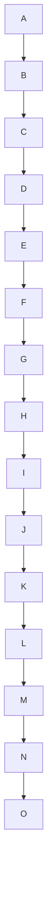
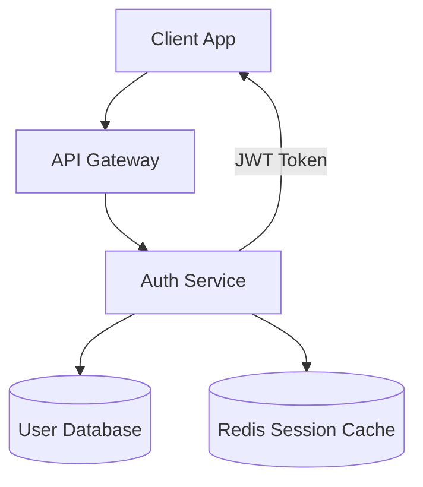

## Mermaid Diagram Guidelines

> **For comprehensive diagram authoring** — type selection across 22 diagram types, style conventions, LangGraph visualization, subgraph composition, and syntax validation — load the `omb-mermaid` skill. This rule covers minimum formatting requirements only.

Use Mermaid diagrams to visualize system architecture, data flows, and relationships. Choose the right diagram type for the content, keep diagrams focused, and label nodes clearly.

### Diagram Type Selection

| Content | Diagram Type | Syntax |
|---------|-------------|--------|
| System architecture, component relationships | `graph TB` or `graph LR` | Top-bottom or left-right flowchart |
| API call flows, multi-service interactions | `sequenceDiagram` | Participant lifelines with messages |
| Database schemas, entity relationships | `erDiagram` | Entity-relationship with cardinality |
| User flows, decision trees | `flowchart TD` | Flowchart with decision diamonds |
| State machines, status lifecycles | `stateDiagram-v2` | State transitions |
| Project timelines | `gantt` | Gantt chart |

### Rules

- Keep diagrams under 30 nodes. Split into multiple diagrams if larger.
- Always include a title comment: `%% Title: [Diagram Name]`
- Use descriptive node labels, not abbreviations: `Auth Service` not `AS`
- Use consistent arrow styles within a diagram
- Wrap in a fenced code block with `mermaid` language tag

**Incorrect (too many nodes, no title, abbreviations):**

```markdown

```

**Correct (focused, titled, descriptive labels):**

```markdown

```

Reference: [Mermaid documentation](https://mermaid.js.org/intro/)
