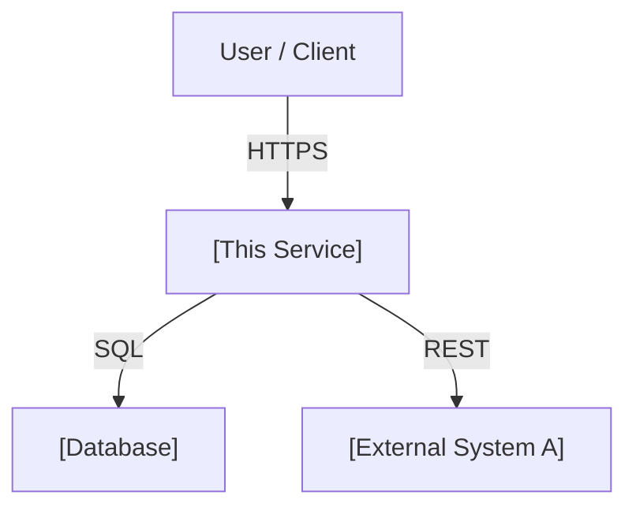
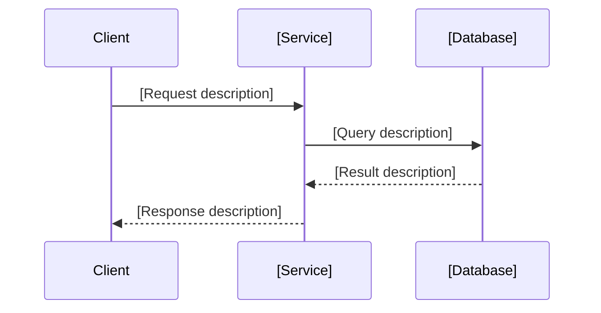
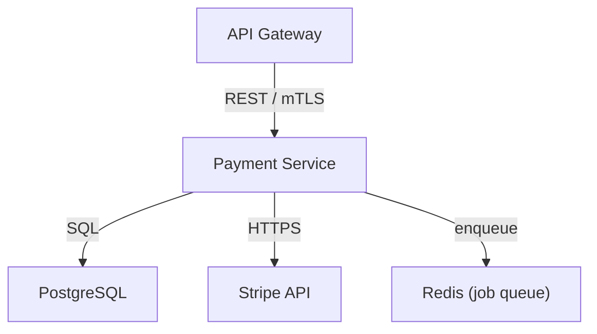
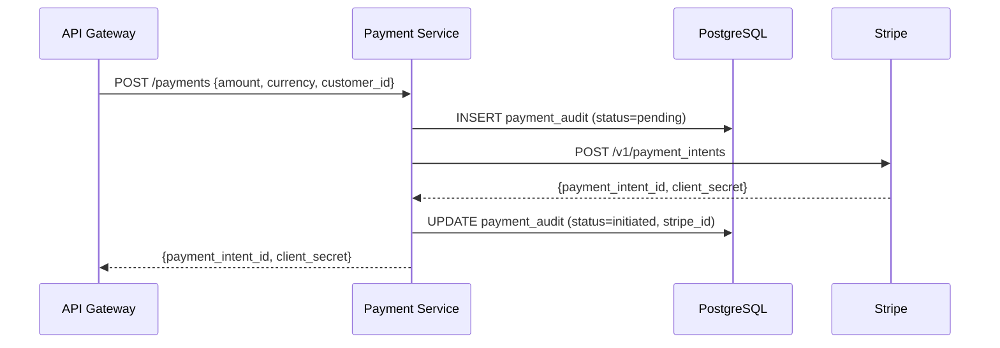

## Architecture Document Template

Every architecture document must cover system context, component breakdown, data flow, key decisions, constraints, and quality targets. Skipping any section leaves readers guessing about scope, rationale, or performance expectations. Use this template when creating or updating files under `docs/architecture/`.

The full template to copy and fill in:

```markdown
---
title: [System or Service Name] Architecture
category: architecture
status: draft
created: YYYY-MM-DD
updated: YYYY-MM-DD
tags: architecture, [domain], [technology]
relates-to: src/[relevant/path]
depends-on: docs/architecture/adr/
---

# [System or Service Name] Architecture

## Overview

[1-2 paragraphs. What does this system do, who uses it, and what problem does it solve?
Mention the primary technology choices and deployment context at a high level.]

## Context Diagram



## Components

| Component | Responsibility | Technology | Location |
|-----------|---------------|------------|----------|
| [Name] | [What it does] | [Language/Framework] | `src/[path]` |
| [Name] | [What it does] | [Language/Framework] | `src/[path]` |

## Data Flow



## Key Decisions

| Decision | Rationale | Alternatives Considered |
|----------|-----------|------------------------|
| [Choice made] | [Why this was chosen] | [Option A], [Option B] |
| [Choice made] | [Why this was chosen] | [Option A] |

See `docs/architecture/adr/` for full ADR records.

## Constraints

- [Constraint 1 — e.g., must support 10k concurrent connections]
- [Constraint 2 — e.g., no PII may leave the EU region]
- [Constraint 3 — e.g., must remain backward-compatible with v1 API]

## Quality Attributes

| Attribute | Target | Measurement |
|-----------|--------|-------------|
| Availability | [e.g., 99.9% uptime] | [e.g., Uptime monitor, 30-day rolling] |
| Latency | [e.g., p99 < 200ms] | [e.g., Grafana histogram, prod traffic] |
| Throughput | [e.g., 500 req/s sustained] | [e.g., Load test with k6] |
| Scalability | [e.g., horizontal pod autoscale] | [e.g., K8s HPA metrics] |
```

---

**Incorrect (sections omitted and diagram missing):**

```markdown
---
title: Payment Service
category: architecture
status: draft
created: 2026-04-10
updated: 2026-04-10
tags: architecture, payments
relates-to: src/payments
depends-on:
---

# Payment Service

This service handles payments using Stripe. It connects to the database and calls Stripe's API.

## Components

- PaymentController
- StripeClient
- PaymentRepository
```

Problems: no overview paragraphs, no context diagram, no data flow, no key decisions, no constraints, no quality attributes, components listed as bullets without a table.

---

**Correct (all sections present and populated):**

```markdown
---
title: Payment Service Architecture
category: architecture
status: active
created: 2026-01-15
updated: 2026-04-10
tags: architecture, payments, stripe
relates-to: src/payments
depends-on: docs/architecture/adr/003-use-stripe.md
---

# Payment Service Architecture

## Overview

The Payment Service handles all monetary transactions for the platform, including
one-time charges, subscription billing, and refund processing. It acts as the
single integration point for Stripe, ensuring that no other service holds Stripe
credentials or makes direct Stripe API calls.

The service is deployed as an async FastAPI application behind the internal API
gateway. All financial operations are logged to an append-only audit table before
any Stripe call is made, guaranteeing a local record regardless of network outcome.

## Context Diagram



## Components

| Component | Responsibility | Technology | Location |
|-----------|---------------|------------|----------|
| PaymentRouter | HTTP routing and request validation | FastAPI | `src/payments/router.py` |
| StripeClient | Stripe API wrapper with retry logic | httpx + tenacity | `src/payments/stripe_client.py` |
| PaymentRepository | Database reads and writes | SQLAlchemy 2.0 async | `src/payments/repository.py` |
| WebhookHandler | Stripe webhook ingestion and verification | FastAPI + hmac | `src/payments/webhooks.py` |

## Data Flow



## Key Decisions

| Decision | Rationale | Alternatives Considered |
|----------|-----------|------------------------|
| Write audit row before Stripe call | Guarantees local record if network fails | Post-write (loses data on crash) |
| Single Stripe integration point | Simplifies credential management and audit | Per-service Stripe clients |
| Async FastAPI | Matches org-wide backend standard | Flask (sync, ruled out for consistency) |

See `docs/architecture/adr/003-use-stripe.md` for the full Stripe integration decision record.

## Constraints

- Stripe credentials must not be accessed outside this service
- All monetary amounts stored and transmitted as integer cents (no floats)
- EU customer data must not be routed through US Stripe endpoints

## Quality Attributes

| Attribute | Target | Measurement |
|-----------|--------|-------------|
| Availability | 99.95% monthly | UptimeRobot, 30-day rolling |
| Charge latency | p99 < 500ms | Grafana histogram, production traffic |
| Throughput | 200 charge req/s sustained | k6 load test, staging env |
| Audit durability | Zero audit record loss | DB WAL + daily backup restore test |
```
