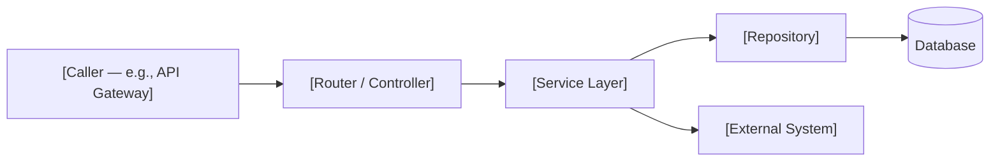
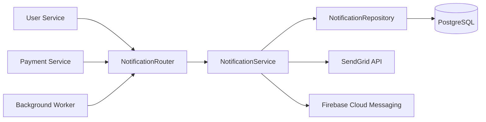

## Backend Service Document Template

Backend documentation must let a new engineer understand what a service does, how it fits into the system, and which functions are the entry points for any given behavior — without reading every source file. Include a service architecture diagram, dependency table, key functions table, error handling summary, and configuration reference. Use this template for files under `docs/backend/`.

The full template to copy and fill in:

```markdown
---
title: [Service Name] Service
category: backend
status: draft
created: YYYY-MM-DD
updated: YYYY-MM-DD
tags: backend, [domain], [technology]
relates-to: src/[service/path]
depends-on: docs/architecture/[service].md, docs/database/[schema].md
---

# [Service Name] Service

## Overview

[1-2 sentences. What business capability does this service provide?
Who are its callers (other services, frontend, background workers)?
What external systems does it touch?]

## Service Architecture



## Dependencies

| Dependency | Type | Purpose |
|------------|------|---------|
| [Library/Service name] | internal / external / infra | [What this service uses it for] |
| [Library/Service name] | internal / external / infra | [What this service uses it for] |

## Key Functions / Methods

| Function | File | Purpose | Input / Output |
|----------|------|---------|----------------|
| `[function_name]` | `src/[path.py]` | [What it does] | `[InputType]` → `[OutputType]` |
| `[function_name]` | `src/[path.py]` | [What it does] | `[InputType]` → `[OutputType]` |

## Error Handling

**Error codes used by this service:**

| Code | HTTP Status | When Raised |
|------|-------------|-------------|
| `[ERROR_CODE]` | [4xx/5xx] | [Condition that causes this error] |
| `[ERROR_CODE]` | [4xx/5xx] | [Condition that causes this error] |

**Retry policy:**

- External calls: [e.g., 3 retries with exponential backoff, max 8s, on 5xx only]
- Database: [e.g., SQLAlchemy connection pool retry, 3 attempts on `OperationalError`]
- No retry on: [e.g., 4xx responses — client errors are not retriable]

## Configuration

Environment variables consumed by this service:

| Variable | Required | Default | Description |
|----------|----------|---------|-------------|
| `[VAR_NAME]` | yes / no | [value or —] | [What it controls] |
| `[VAR_NAME]` | yes / no | [value or —] | [What it controls] |

See `.env.example` for a complete list with sample values.
```

---

**Incorrect (no diagram, no function table, error handling described in prose):**

```markdown
---
title: Notification Service
category: backend
status: draft
created: 2026-04-10
updated: 2026-04-10
tags: backend
relates-to: src/notifications
depends-on:
---

# Notification Service

This service sends emails and push notifications. It uses SendGrid for emails.
It has some retry logic. The main files are router.py, service.py, and
repository.py. Set SENDGRID_API_KEY to your SendGrid key.
```

Problems: no service architecture diagram, no dependency table, no key functions table, no error code table, no retry policy details, configuration described as prose instead of a table.

---

**Correct (diagram, all tables, error codes, retry policy, configuration table):**

```markdown
---
title: Notification Service
category: backend
status: active
created: 2026-02-10
updated: 2026-04-10
tags: backend, notifications, email, push
relates-to: src/notifications
depends-on: docs/architecture/notification-service.md, docs/database/schema-notifications.md
---

# Notification Service

## Overview

The Notification Service delivers email and push notifications triggered by
platform events (signup, payment, password reset). It is called by the
User Service and Payment Service via internal RPC, and by the background
job worker for scheduled digests. SendGrid handles email delivery; Firebase
Cloud Messaging handles push.

## Service Architecture



## Dependencies

| Dependency | Type | Purpose |
|------------|------|---------|
| `sendgrid-python` | external | Email delivery via SendGrid API |
| `firebase-admin` | external | Push notification delivery via FCM |
| `PostgreSQL` | infra | Persists notification records and delivery status |
| `User Service` | internal | Fetches user contact preferences before sending |
| `tenacity` | external | Retry logic for external API calls |

## Key Functions / Methods

| Function | File | Purpose | Input / Output |
|----------|------|---------|----------------|
| `send_notification` | `src/notifications/service.py` | Dispatches email or push based on user preference | `NotificationRequest` → `NotificationResult` |
| `send_email` | `src/notifications/email.py` | Renders template and calls SendGrid | `EmailPayload` → `SendGridResponse` |
| `send_push` | `src/notifications/push.py` | Calls FCM with device token and payload | `PushPayload` → `FCMResponse` |
| `record_delivery` | `src/notifications/repository.py` | Writes delivery outcome to DB | `DeliveryRecord` → `None` |

## Error Handling

**Error codes used by this service:**

| Code | HTTP Status | When Raised |
|------|-------------|-------------|
| `NOTIFICATION_DELIVERY_FAILED` | 502 | SendGrid or FCM returned a non-retriable error |
| `USER_PREFERENCES_UNAVAILABLE` | 503 | User Service did not respond within timeout |
| `INVALID_TEMPLATE` | 400 | Notification template name is not registered |
| `MISSING_RECIPIENT` | 422 | No email address or device token found for user |

**Retry policy:**

- SendGrid and FCM calls: 3 retries with exponential backoff (1s, 2s, 4s), on 5xx and network timeout only
- User Service calls: 2 retries with 500ms fixed delay, on 503 only
- No retry on: 4xx responses, `MISSING_RECIPIENT`, `INVALID_TEMPLATE`

## Configuration

| Variable | Required | Default | Description |
|----------|----------|---------|-------------|
| `SENDGRID_API_KEY` | yes | — | SendGrid API key for email delivery |
| `FCM_CREDENTIALS_FILE` | yes | — | Path to Firebase service account JSON file |
| `NOTIFICATION_TIMEOUT_SECONDS` | no | `5` | Timeout for outbound SendGrid and FCM calls |
| `USER_SERVICE_BASE_URL` | yes | — | Internal URL of the User Service |
| `NOTIFICATION_RETRY_MAX` | no | `3` | Maximum retry attempts for delivery failures |

See `.env.example` for a complete list with sample values.
```
