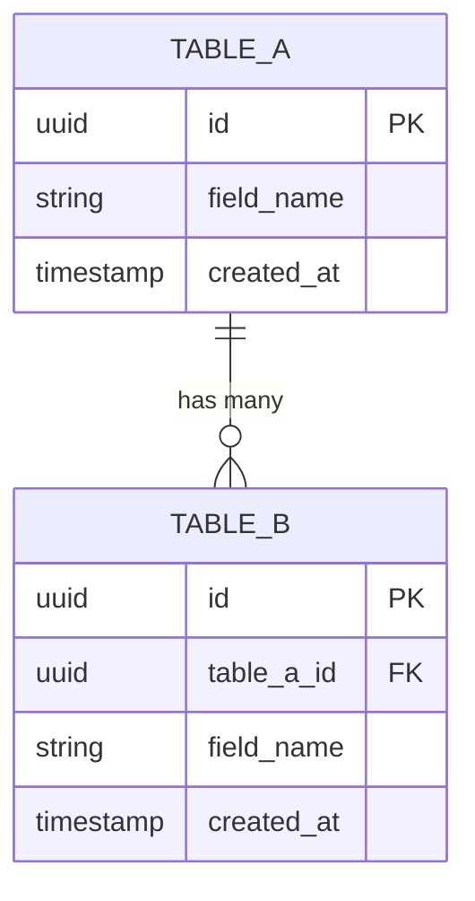
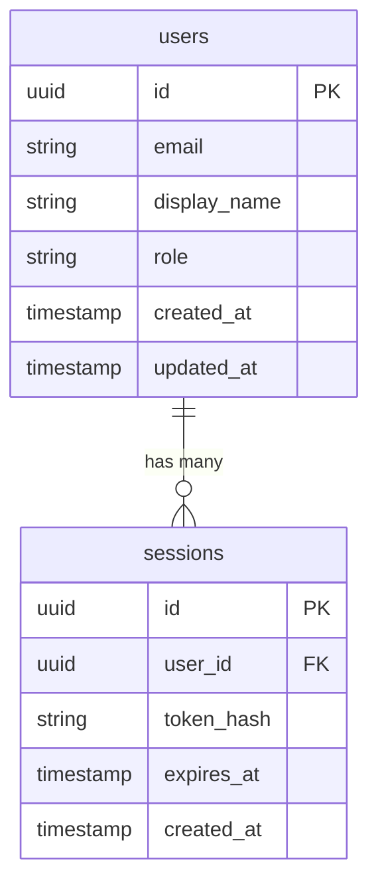

## Database Schema Document Template

Database documentation must be precise enough for a developer to write queries, plan migrations, and reason about performance without opening the ORM models. Every table needs a column table, index table, and constraint table. Include an ERD and migration log. Add a Redis keys section only when the service uses Redis. Use this template for files under `docs/database/`.

The full template to copy and fill in:

```markdown
---
title: [Service or Feature Name] Schema
category: database
status: draft
created: YYYY-MM-DD
updated: YYYY-MM-DD
tags: database, schema, [domain]
relates-to: src/[models/path]
depends-on: docs/architecture/[service].md
---

# [Service or Feature Name] Schema

## Overview

[1-2 sentences. What data does this schema store? Which service owns these
tables? Mention the database engine and any notable design choices
(e.g., append-only audit table, soft deletes, UUID primary keys).]

## Entity Relationship Diagram



---

## Tables

### `[table_name]`

**Purpose:** [One sentence — what records this table holds and why.]

**Columns**

| Column | Type | Nullable | Default | Description |
|--------|------|----------|---------|-------------|
| `id` | UUID | no | `gen_random_uuid()` | Primary key |
| `[column]` | [type] | [yes/no] | [value or —] | [Description] |
| `created_at` | TIMESTAMPTZ | no | `now()` | Record creation time (UTC) |
| `updated_at` | TIMESTAMPTZ | no | `now()` | Last modification time (UTC) |

**Indexes**

| Name | Columns | Type | Purpose |
|------|---------|------|---------|
| `[table]_pkey` | `id` | PRIMARY KEY | Uniqueness and lookup by PK |
| `[table]_[col]_idx` | `[column]` | BTREE | [Query pattern this supports] |

**Constraints**

| Name | Type | Definition |
|------|------|------------|
| `[table]_pkey` | PRIMARY KEY | `id` |
| `[table]_[col]_fkey` | FOREIGN KEY | `[col]` → `[other_table](id)` ON DELETE [CASCADE/RESTRICT] |
| `[table]_[col]_check` | CHECK | `[column] IN ('value_a', 'value_b')` |

---

[Repeat the table block above for each table]

---

## Migration Log

| Version | Date | Description | Reversible |
|---------|------|-------------|------------|
| [NNN] | YYYY-MM-DD | [What changed — add/drop/alter] | yes / no |

Migration files: `alembic/versions/`

---

## Redis Keys

> Omit this section if the service does not use Redis.

| Key Pattern | Type | TTL | Purpose |
|-------------|------|-----|---------|
| `[namespace]:[id]` | string | [N]s / no expiry | [What is cached or stored] |
| `[namespace]:lock:[id]` | string | [N]s | [Distributed lock purpose] |
| `[namespace]:set:[id]` | set | no expiry | [Set membership purpose] |
```

---

**Incorrect (narrative instead of tables, no ERD, no migration log):**

```markdown
---
title: User Schema
category: database
status: draft
created: 2026-04-10
updated: 2026-04-10
tags: database
relates-to: src/models
depends-on:
---

# User Schema

The users table stores user accounts. It has an id (uuid), email (text),
display_name (text), role (text), created_at (timestamp), and updated_at
(timestamp). The email column has a unique index. There is also a sessions
table that references users.
```

Problems: no ERD, columns described in prose instead of a table, no nullable/default columns, no index table, no constraint table, no migration log.

---

**Correct (ERD, full column/index/constraint tables, migration log, Redis section):**

```markdown
---
title: User and Session Schema
category: database
status: active
created: 2026-01-20
updated: 2026-04-10
tags: database, schema, users, auth
relates-to: src/models/user.py, src/models/session.py
depends-on: docs/architecture/user-service.md
---

# User and Session Schema

## Overview

This schema stores user accounts and active authentication sessions for the
platform. Tables are owned by the User Service. Primary keys are UUIDs
generated by PostgreSQL. Sessions are soft-expired via `expires_at` rather
than deleted, to preserve the audit trail.

## Entity Relationship Diagram



---

## Tables

### `users`

**Purpose:** Stores one record per registered platform user.

**Columns**

| Column | Type | Nullable | Default | Description |
|--------|------|----------|---------|-------------|
| `id` | UUID | no | `gen_random_uuid()` | Primary key |
| `email` | TEXT | no | — | Unique email address, lowercase-normalized on write |
| `display_name` | TEXT | no | — | 2–100 characters |
| `role` | TEXT | no | `'member'` | One of `member`, `admin` |
| `created_at` | TIMESTAMPTZ | no | `now()` | Account creation time (UTC) |
| `updated_at` | TIMESTAMPTZ | no | `now()` | Last profile update time (UTC) |

**Indexes**

| Name | Columns | Type | Purpose |
|------|---------|------|---------|
| `users_pkey` | `id` | PRIMARY KEY | Uniqueness and PK lookup |
| `users_email_idx` | `email` | UNIQUE BTREE | Login lookup by email |

**Constraints**

| Name | Type | Definition |
|------|------|------------|
| `users_pkey` | PRIMARY KEY | `id` |
| `users_email_unique` | UNIQUE | `email` |
| `users_role_check` | CHECK | `role IN ('member', 'admin')` |

---

### `sessions`

**Purpose:** Tracks active authentication sessions. Expired rows are retained for audit purposes.

**Columns**

| Column | Type | Nullable | Default | Description |
|--------|------|----------|---------|-------------|
| `id` | UUID | no | `gen_random_uuid()` | Primary key |
| `user_id` | UUID | no | — | FK to `users.id` |
| `token_hash` | TEXT | no | — | SHA-256 of the raw session token (token never stored) |
| `expires_at` | TIMESTAMPTZ | no | — | Session expiry time (UTC) |
| `created_at` | TIMESTAMPTZ | no | `now()` | Session creation time (UTC) |

**Indexes**

| Name | Columns | Type | Purpose |
|------|---------|------|---------|
| `sessions_pkey` | `id` | PRIMARY KEY | Uniqueness and PK lookup |
| `sessions_user_id_idx` | `user_id` | BTREE | List all sessions for a user |
| `sessions_token_hash_idx` | `token_hash` | UNIQUE BTREE | Token validation lookup |
| `sessions_expires_at_idx` | `expires_at` | BTREE | Expired session cleanup job |

**Constraints**

| Name | Type | Definition |
|------|------|------------|
| `sessions_pkey` | PRIMARY KEY | `id` |
| `sessions_user_id_fkey` | FOREIGN KEY | `user_id` → `users(id)` ON DELETE CASCADE |
| `sessions_token_hash_unique` | UNIQUE | `token_hash` |

---

## Migration Log

| Version | Date | Description | Reversible |
|---------|------|-------------|------------|
| 001 | 2026-01-20 | Create `users` table | yes |
| 002 | 2026-02-05 | Create `sessions` table | yes |
| 003 | 2026-03-12 | Add `role` column with default `member` | yes |
| 004 | 2026-04-10 | Add `sessions_expires_at_idx` for cleanup job | yes |

Migration files: `alembic/versions/`

---

## Redis Keys

| Key Pattern | Type | TTL | Purpose |
|-------------|------|-----|---------|
| `session:valid:{token_hash}` | string | 300s | Short-lived cache of validated session to reduce DB reads |
| `user:profile:{user_id}` | string (JSON) | 600s | Cached user profile for authenticated requests |
| `rate:login:{ip}` | string (counter) | 60s | Failed login attempt counter per IP for brute-force protection |
```
