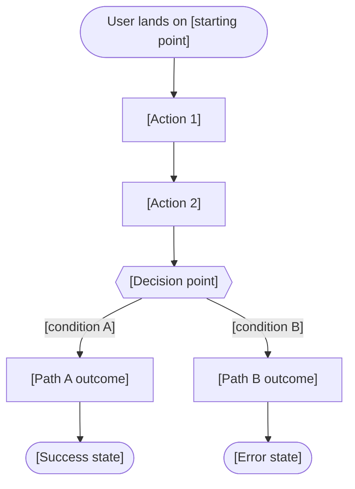
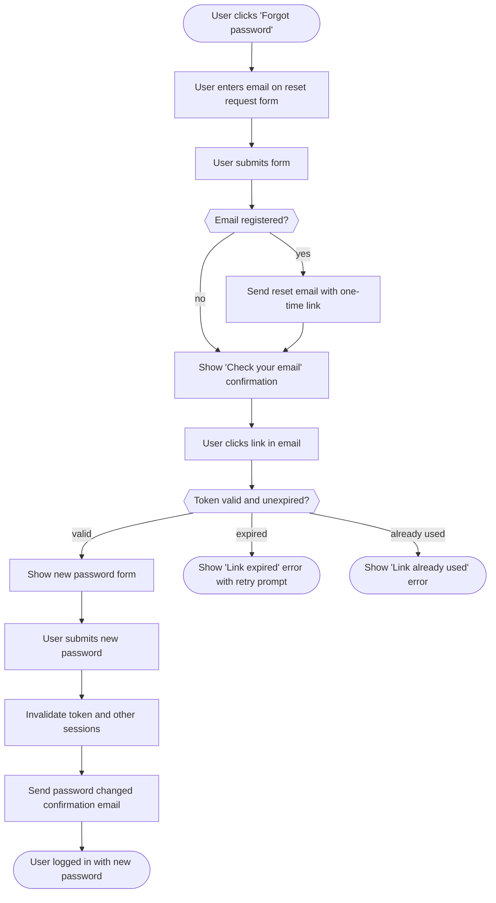

## Feature Specification Template

A feature specification is the single source of truth for what is being built, why, and how success is measured. It must include user stories written from the user's perspective, measurable acceptance criteria, a user flow diagram, pointers to the technical design documents that detail implementation, a dependency table, and a feature flag table. Use this template for files under `docs/features/`.

The full template to copy and fill in:

```markdown
---
title: [Feature Name]
category: features
status: draft
created: YYYY-MM-DD
updated: YYYY-MM-DD
tags: feature, [domain], [priority]
relates-to: src/[feature/path]
depends-on: docs/api/[api].md, docs/database/[schema].md
---

# [Feature Name]

## Overview

[1-2 paragraphs. What is this feature? What problem does it solve and for
whom? Include any background context that a new contributor would need to
understand why this is being built now.]

## User Stories

- As a [role], I want to [action] so that [benefit].
- As a [role], I want to [action] so that [benefit].
- As a [role], I want to [action] so that [benefit].

## Acceptance Criteria

- [ ] [Criterion 1 — observable, testable behavior]
- [ ] [Criterion 2 — observable, testable behavior]
- [ ] [Criterion 3 — observable, testable behavior]
- [ ] [Criterion 4 — error or edge case handled]
- [ ] [Criterion 5 — performance or security requirement]

## User Flow



## Technical Design

This section links to the implementation documents rather than duplicating
content. Each link should point to the relevant section within the doc.

- **Architecture:** [docs/architecture/[service].md](../architecture/[service].md)
- **API:** [docs/api/[api-doc].md](../api/[api-doc].md) — endpoints `[METHOD /path]`
- **Database:** [docs/database/[schema].md](../database/[schema].md) — tables `[table_a]`, `[table_b]`
- **Frontend:** [docs/frontend/[module].md](../frontend/[module].md)
- **Backend:** [docs/backend/[service].md](../backend/[service].md)

## Dependencies

| Dependency | Type | Status |
|------------|------|--------|
| [Feature / Service / Library] | blocking / non-blocking | done / in-progress / not-started |
| [Feature / Service / Library] | blocking / non-blocking | done / in-progress / not-started |

## Feature Flags

| Flag | Default | Description |
|------|---------|-------------|
| `[flag_name]` | off / on | [What enabling/disabling this flag controls] |
| `[flag_name]` | off / on | [What enabling/disabling this flag controls] |

> Omit this section if the feature ships without flags.
```

---

**Incorrect (no user flow diagram, vague acceptance criteria, no technical design links):**

```markdown
---
title: Password Reset
category: features
status: draft
created: 2026-04-10
updated: 2026-04-10
tags: feature
relates-to: src/auth
depends-on:
---

# Password Reset

Users should be able to reset their password if they forget it. They enter
their email, get a link, click it, and set a new password.

## Acceptance Criteria

- It works
- Email is sent
- Password is changed
```

Problems: overview is a single vague sentence, no user stories, acceptance criteria are not testable or observable, no user flow diagram, no technical design section, no dependency table, no feature flag table.

---

**Correct (all sections, testable criteria, mermaid flow, design links):**

```markdown
---
title: Password Reset
category: features
status: active
created: 2026-03-01
updated: 2026-04-10
tags: feature, auth, security
relates-to: src/auth/password-reset
depends-on: docs/api/auth-api.md, docs/database/schema-auth.md
---

# Password Reset

## Overview

Password Reset allows users who have forgotten their credentials to regain
access to their account via a time-limited email link. This replaces the
current support-team manual process, which requires a ticket and 24-hour
turnaround.

The feature uses a one-time reset token stored in the database with a 15-minute
expiry. Tokens are invalidated immediately after use. No password is stored or
transmitted in the reset link itself.

## User Stories

- As a registered user, I want to request a password reset email so that I can
  regain access to my account without contacting support.
- As a registered user, I want the reset link to expire after 15 minutes so that
  my account is not exposed to a leaked link indefinitely.
- As a registered user, I want to be notified when my password is changed so
  that I know if an unauthorized reset occurred.

## Acceptance Criteria

- [ ] Submitting a valid email on the reset request form sends a reset email
      within 30 seconds
- [ ] Submitting an unknown email address shows the same confirmation message
      (no user enumeration)
- [ ] The reset link expires after 15 minutes; clicking an expired link shows a
      clear error message with a prompt to request a new one
- [ ] A reset link can only be used once; a second click shows an error
- [ ] After a successful password reset, all other active sessions for the user
      are invalidated
- [ ] A confirmation email is sent to the user after a successful password change
- [ ] The reset flow is accessible to screen readers (WCAG 2.1 AA)

## User Flow



## Technical Design

- **API:** [docs/api/auth-api.md](../api/auth-api.md) — endpoints `POST /auth/password-reset/request`, `POST /auth/password-reset/confirm`
- **Database:** [docs/database/schema-auth.md](../database/schema-auth.md) — table `password_reset_tokens`
- **Backend:** [docs/backend/auth-service.md](../backend/auth-service.md)
- **Frontend:** [docs/frontend/password-reset.md](../frontend/password-reset.md)

## Dependencies

| Dependency | Type | Status |
|------------|------|--------|
| Email delivery (Notification Service) | blocking | done |
| Session invalidation endpoint (Auth Service) | blocking | in-progress |
| WCAG audit tooling in CI | non-blocking | not-started |

## Feature Flags

| Flag | Default | Description |
|------|---------|-------------|
| `auth.password_reset_enabled` | off | Gates the entire password reset flow; disabling returns a 404 on both endpoints |
| `auth.password_reset_notify_on_change` | on | Controls whether the post-reset confirmation email is sent |
```
