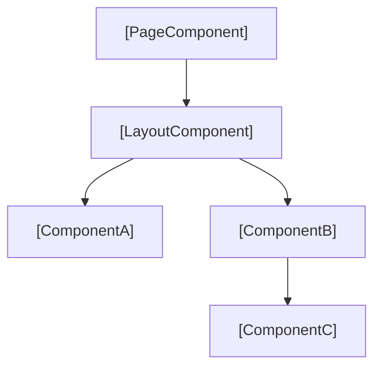
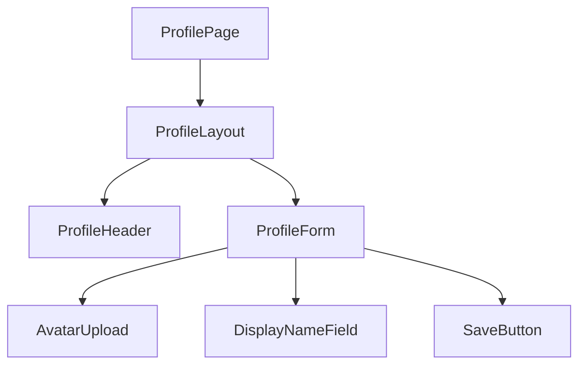

## Frontend Component Document Template

Frontend documentation must let a developer understand the component hierarchy, where state lives, how routing is structured, and which design tokens to use — without tracing through every import. A component hierarchy diagram prevents re-invention of existing components. A routes table prevents duplicate route definitions. Use this template for files under `docs/frontend/`.

The full template to copy and fill in:

```markdown
---
title: [Feature or Module Name] Frontend
category: frontend
status: draft
created: YYYY-MM-DD
updated: YYYY-MM-DD
tags: frontend, [domain], react
relates-to: src/[feature/path]
depends-on: docs/api/[api-doc].md
---

# [Feature or Module Name] Frontend

## Overview

[1-2 sentences. What UI capability does this module provide? Who is the
user? What does the user accomplish through this interface?]

## Component Hierarchy



## State Management

**Stores / Contexts used by this module:**

| Store / Context | Library | Scope | Purpose |
|-----------------|---------|-------|---------|
| `[StoreName]` | [Zustand / React Context / Jotai] | [global / feature] | [What state it manages] |
| `[StoreName]` | [Zustand / React Context / Jotai] | [global / feature] | [What state it manages] |

**Key state shapes:**

```typescript
// [StoreName] — src/stores/[store-name].ts
interface [StoreState] {
  [field]: [Type];
  [field]: [Type] | null;
}
```

## Routes

| Path | Component | Auth Required | Description |
|------|-----------|---------------|-------------|
| `/[path]` | `[PageComponent]` | yes / no | [What this page shows or does] |
| `/[path]/[param]` | `[PageComponent]` | yes / no | [What this page shows or does] |

Route definitions: `src/[routes/path]`

## Design Tokens

Colors, spacing, and typography follow the shared design system. Reference tokens from `src/styles/tokens.ts` — do not use raw hex values or pixel values in components.

**Key tokens used by this module:**

| Token | Value | Usage |
|-------|-------|-------|
| `[token.name]` | [value or "see tokens.ts"] | [Where it is used] |
| `[token.name]` | [value or "see tokens.ts"] | [Where it is used] |

Full token reference: `docs/frontend/_design-system.md`

## Key Components

| Component | Props | Purpose | Location |
|-----------|-------|---------|----------|
| `[ComponentName]` | `[PropA, PropB?]` | [What it renders or handles] | `src/[path/Component.tsx]` |
| `[ComponentName]` | `[PropA, PropB?]` | [What it renders or handles] | `src/[path/Component.tsx]` |
```

---

**Incorrect (no hierarchy diagram, no state table, routes in prose):**

```markdown
---
title: User Profile Frontend
category: frontend
status: draft
created: 2026-04-10
updated: 2026-04-10
tags: frontend
relates-to: src/features/profile
depends-on:
---

# User Profile Frontend

The profile page shows the user's name, email, and avatar. It has a form to
edit the display name. The route is /profile. The component is ProfilePage
which contains ProfileForm and AvatarUpload. State is managed in a Zustand store.
```

Problems: no component hierarchy diagram, no state shape, no routes table, no design tokens section, no key components table, all information in unstructured prose.

---

**Correct (diagram, state shapes, routes table, tokens, components table):**

```markdown
---
title: User Profile Frontend
category: frontend
status: active
created: 2026-02-15
updated: 2026-04-10
tags: frontend, profile, user, react
relates-to: src/features/profile
depends-on: docs/api/user-api.md
---

# User Profile Frontend

## Overview

The User Profile module lets authenticated users view and edit their account
details — display name, email, and avatar. Changes are submitted to the User
API and reflected immediately in the top navigation bar without a page reload.

## Component Hierarchy



## State Management

| Store / Context | Library | Scope | Purpose |
|-----------------|---------|-------|---------|
| `useProfileStore` | Zustand | feature | Holds form state, loading flag, and save error |
| `useAuthContext` | React Context | global | Provides the authenticated user ID and token |

**Key state shapes:**

```typescript
// useProfileStore — src/features/profile/store.ts
interface ProfileState {
  displayName: string;
  avatarUrl: string | null;
  isSaving: boolean;
  saveError: string | null;
  setDisplayName: (name: string) => void;
  save: () => Promise<void>;
}
```

## Routes

| Path | Component | Auth Required | Description |
|------|-----------|---------------|-------------|
| `/profile` | `ProfilePage` | yes | View and edit the authenticated user's profile |
| `/profile/avatar` | `AvatarUploadPage` | yes | Dedicated avatar crop and upload flow |

Route definitions: `src/app/router.tsx`

## Design Tokens

| Token | Value | Usage |
|-------|-------|-------|
| `color.surface.primary` | `#ffffff` | Card background on the profile form |
| `color.text.muted` | `#6b7280` | Helper text below form fields |
| `spacing.form.gap` | `1.5rem` | Gap between form fields |
| `radius.card` | `0.75rem` | Border radius on the profile card |

Full token reference: `docs/frontend/_design-system.md`

## Key Components

| Component | Props | Purpose | Location |
|-----------|-------|---------|----------|
| `ProfilePage` | — | Route entry point, loads current user data | `src/features/profile/ProfilePage.tsx` |
| `ProfileForm` | `userId: string` | Wraps all editable fields, handles submit | `src/features/profile/ProfileForm.tsx` |
| `AvatarUpload` | `currentUrl: string \| null, onUpload: (url) => void` | File picker and preview for avatar | `src/features/profile/AvatarUpload.tsx` |
| `DisplayNameField` | `value: string, onChange: (v: string) => void` | Controlled text input with validation | `src/features/profile/DisplayNameField.tsx` |
| `SaveButton` | `isLoading: boolean, disabled: boolean` | Submit button with loading state | `src/components/SaveButton.tsx` |
```
