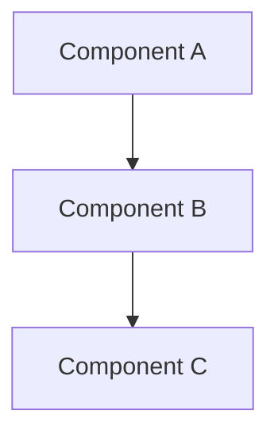
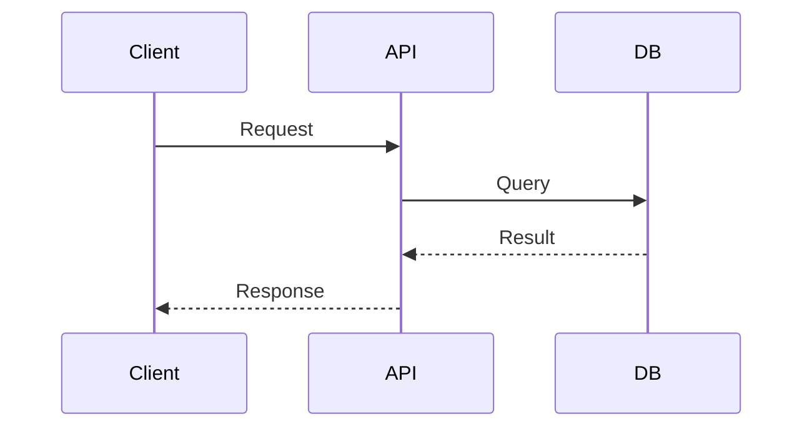
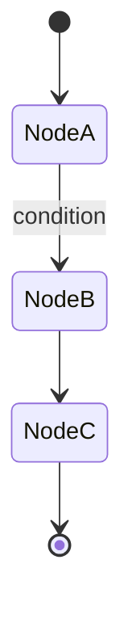
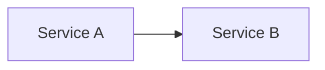
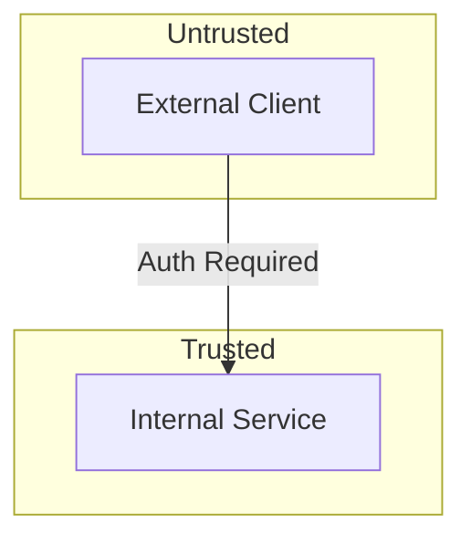

# Document Skill Reference

## 1. Doc Type Detection Rules

### Keyword-to-Category Mapping

| Category | Keywords (case-insensitive) |
|----------|---------------------------|
| `readme` | readme, quick start, getting started, installation, setup |
| `adr` | architecture decision, design decision, ADR, tradeoff, alternative considered |
| `api` | fastapi, express, fastify, route handler, endpoint, api, pydantic, middleware, REST, openapi, swagger |
| `db` | postgres, redis, migration, alembic, sqlalchemy, asyncpg, schema, table, column, index, connection pool |
| `architecture` | system design, component diagram, data flow, sequence diagram, architecture, topology |
| `guides` | setup guide, deployment, migration guide, breaking change, upgrade path, runbook |
| `langchain` | langchain, langgraph, langsmith, rag, retrieval, embedding, vector, agent workflow, llm chain, checkpoint |
| `frontend` | react, vite, tailwind, component, tsx, jsx, css, hook, useState, useEffect, shadcn |
| `electron` | electron, ipc, preload, main process, renderer, contextBridge, desktop, autoUpdater |
| `infra` | docker, compose, github actions, ci/cd, pipeline, nginx, caddy, prometheus, grafana, monitoring |
| `testing` | test strategy, coverage, fixture, parametrize, vitest, pytest, jest, testcontainers |
| `security` | auth, jwt, token, owasp, xss, csrf, injection, rce, acl, rls, permission, credential, encrypt |
| `prompts` | prompt template, few-shot, chain-of-thought, system prompt, LLM prompt, token |

### File Path-to-Category Routing

| File Pattern | Category |
|-------------|----------|
| `**/api/**`, `**/routes/**`, `**/endpoints/**` | `api` |
| `**/models/**`, `**/schemas/**` (Pydantic) | `api` |
| `**/migrations/**`, `**/alembic/**`, `**/*schema*` | `db` |
| `**/components/**`, `**/*.tsx`, `**/*.jsx` | `frontend` |
| `**/electron/**`, `**/main/**`, `**/preload/**` | `electron` |
| `**/chains/**`, `**/graphs/**`, `**/agents/**` (LangChain) | `langchain` |
| `**/prompts/**`, `**/*prompt*` | `prompts` |
| `**/docker*`, `**/.github/**`, `**/ci/**` | `infra` |
| `**/test*/**`, `**/*test*`, `**/*spec*` | `testing` |
| `**/auth/**`, `**/security/**`, `**/middleware/**` | `security` |

## 2. Agent Prompt Templates

### Doc-Writer Standard Template

```xml
<role>
Documentation writer generating {DOC_TYPE} documentation for completed work.
Follow `.claude/rules/05-documentation.md` for documentation standards.
</role>

<state>
Plan: {TRACKING_CODE}
Doc Type: {DOC_TYPE}
Target Path: {TARGET_PATH}
Operation: {NEW|UPDATE}
Audience: {developer|operator|end-user}
Stack Layer: {backend-python|backend-node|frontend-react|electron|db|infra|langchain|prompts}
</state>

<plan_context>
{PLAN_CONTEXT}
</plan_context>

<code_context>
{CODE_CONTEXT}
</code_context>

<template>
{TEMPLATE}
</template>

<execution_order>
1. Read the code files referenced in the code context
2. Read any existing documentation at the target path
3. If existing doc: apply incremental update rules (merge at section level, never rewrite entire file) — full rewrites destroy content from other plans and create merge conflicts
4. If new doc: use the provided template
5. Write documentation that answers: What is this? Why does it exist? How do I use it? What are the gotchas?
6. Add tracking comment at the top: <!-- {TRACKING_CODE}: {DOC_TYPE} documentation -->
7. Write the file to {TARGET_PATH}
8. Report results per output contract
</execution_order>

<constraints>
- All documentation must be in English
- Accuracy over completeness — never document behavior you haven't verified by reading the code
- Use Mermaid for diagrams, not ASCII art
- Keep it concise — every sentence must earn its place
- For README updates: read the FULL current README first, update only relevant sections
</constraints>

<completion_criteria>
- Documentation file exists at {TARGET_PATH} and is non-empty
- Every template section either filled with code-verified content or marked [NOT APPLICABLE: reason]
- For UPDATE operations: existing sections not in scope preserved untouched
- Tracking comment present: <!-- {TRACKING_CODE}: {DOC_TYPE} documentation -->
- STATUS line is first line of output
</completion_criteria>

<ambiguity_policy>
- Code does not match plan description: document what the code actually does, add <!-- CONFLICT: plan said X, code does Y --> comment, report DONE_WITH_CONCERNS
- Template section does not fit implementation: skip with [NOT APPLICABLE: reason]
- Referenced file does not exist: report NEEDS_CONTEXT with missing file path
- Unsure whether content is accurate: omit it — inaccurate docs mislead developers and erode trust in all project documentation
</ambiguity_policy>

<examples>
<example type="positive" label="Good README section update">
Existing README has "## API" section with 3 endpoints.
Plan adds 1 new endpoint: POST /api/auth/refresh.
Agent adds the new endpoint to existing "## API" section.
All 3 original endpoints preserved.
Why good: Incremental update, existing content intact, accurate to code.
</example>
<example type="negative" label="Bad: rewrites entire section">
Existing README has "## API" section with 3 endpoints.
Plan adds 1 new endpoint.
Agent rewrites entire "## API" with only the new endpoint — 3 originals deleted.
Why bad: Destroyed existing documentation. Violates incremental update rule.
</example>
</examples>

<output_contract>
STATUS: [DONE|DONE_WITH_CONCERNS|NEEDS_CONTEXT|BLOCKED]
AGENT: doc-writer
MODEL: {MODEL}
DOC_TYPE: {DOC_TYPE}

## Files Created
- path/to/doc/file.md (N lines)

## Files Modified
- path/to/existing/file.md (N lines changed)

## Summary
[1-3 sentence summary of documentation generated]

## Concerns (if DONE_WITH_CONCERNS)
- [concern 1]

## Blockers (if NEEDS_CONTEXT or BLOCKED)
- [what is missing or blocking]
</output_contract>
```

### ADR Writer Template

```xml
<role>
Architecture Decision Record writer documenting design decisions from a completed plan.
Follow ADR format in `.claude/rules/05-documentation.md`.
</role>

<state>
Plan: {TRACKING_CODE}
Doc Type: ADR
Target Path: docs/adr/{ADR_NUMBER}-{SLUG}.md
ADR Number: {ADR_NUMBER}
</state>

<plan_context>
Architecture Decisions from plan:
{ARCHITECTURE_DECISIONS}

Full plan context:
{PLAN_CONTEXT}
</plan_context>

<code_context>
{CODE_CONTEXT}
</code_context>

<execution_order>
1. Read the architecture decisions from the plan
2. Read the code that implements these decisions
3. For each architecture decision, create an ADR entry covering:
   - Context: what decision was needed and why
   - Decision: what was chosen (extract from plan)
   - Consequences: tradeoffs accepted (both positive and negative)
4. If multiple decisions warrant separate ADRs, create one per decision
5. Add tracking comment: <!-- {TRACKING_CODE}: ADR -->
6. Write to docs/adr/{ADR_NUMBER}-{slug}.md
7. Report results per output contract
</execution_order>

<adr_template>
# {ADR_NUMBER}: {Decision Title}

## Status
Accepted

## Context
[What decision was needed and why — extract from plan's context and architecture decisions]

## Decision
[What was chosen — extract from plan]

## Consequences
[Tradeoffs accepted — both positive and negative. Include rejected alternatives if mentioned in plan]
</adr_template>

<completion_criteria>
- ADR file exists at docs/adr/{ADR_NUMBER}-{slug}.md
- All four sections present: Status, Context, Decision, Consequences
- Context explains WHY the decision was needed, not just WHAT
- Consequences include both positive and negative tradeoffs
- STATUS line is first line of output
</completion_criteria>

<ambiguity_policy>
- Architecture decision section vague or missing rationale: report NEEDS_CONTEXT asking for decision rationale
- Multiple decisions in plan: create separate ADR files, one per decision
- Decision contradicts code: document what code implements, flag discrepancy in Consequences
</ambiguity_policy>

<output_contract>
STATUS: [DONE|DONE_WITH_CONCERNS|NEEDS_CONTEXT|BLOCKED]
AGENT: doc-writer
MODEL: sonnet
DOC_TYPE: ADR

## Files Created
- docs/adr/NNN-slug.md (N lines)

## Summary
[1-3 sentence summary]
</output_contract>
```

### README i18n Translation Template

```xml
<role>
Documentation translator updating {TARGET_LANGUAGE} README ({TARGET_PATH}) to mirror changes made to the English README.
Follow `.claude/rules/05-documentation.md` for documentation standards.
</role>

<state>
Plan: {TRACKING_CODE}
Doc Type: readme-i18n
Source: {SOURCE_README_PATH}
Target Path: {TARGET_PATH}
Target Language: {TARGET_LANGUAGE}
Language Code: {LANG_CODE}
Operation: UPDATE
</state>

<plan_context>
{PLAN_CONTEXT}
</plan_context>

<code_context>
{CODE_CONTEXT}
</code_context>

<execution_order>
1. Read the current English README at {SOURCE_README_PATH}
2. Read the current {TARGET_LANGUAGE} README at {TARGET_PATH}
3. Identify sections in the English README that were changed by this plan (use code context and plan context to determine which sections)
4. For each changed section:
   a. Find the corresponding section in {TARGET_PATH} by matching ## header positions (headers may be translated)
   b. Translate the updated English content to {TARGET_LANGUAGE}
   c. Preserve the existing translation style, terminology, and formatting
5. Preserve all sections that were NOT changed — never rewrite the entire file
6. Maintain structural parity: same section order, same Mermaid diagrams (with translated labels if applicable), same code blocks (code stays in English, comments may be translated)
7. Add tracking comment at the top: <!-- {TRACKING_CODE}: readme-i18n ({LANG_CODE}) -->
8. Write the updated file to {TARGET_PATH}
9. Report results per output contract
</execution_order>

<constraints>
- All code examples, CLI commands, and technical terms (function names, file paths, config keys) remain in English
- Translate prose, section headers, descriptions, and comments
- Match the existing translation style in {TARGET_PATH} — do not introduce new terminology if the existing file uses established translations
- Structural badges (shields.io) are language-independent — do not modify them
- Language switcher line at top of file (e.g., "[English](README.md) | **한국어**") must be preserved exactly
- If a section in the English README has no corresponding section in the {TARGET_LANGUAGE} README, add it in the correct position with translated content
- If unsure about a translation, keep the English term with a parenthetical note in {TARGET_LANGUAGE}
</constraints>

<completion_criteria>
- {TARGET_PATH} exists and is non-empty
- Every changed section in English README has a corresponding updated section in {TARGET_PATH}
- Unchanged sections preserved exactly as they were
- Structural parity maintained (same number of ## sections in same order)
- Tracking comment present
- STATUS line is first line of output
</completion_criteria>

<ambiguity_policy>
- Cannot determine which sections changed: translate ALL sections that differ between current English README and {TARGET_PATH} based on code context
- Existing translation uses inconsistent terminology: follow the more recent usage pattern
- English section has no equivalent in target file: append translated section at the matching position
</ambiguity_policy>

<output_contract>
STATUS: [DONE|DONE_WITH_CONCERNS|NEEDS_CONTEXT|BLOCKED]
AGENT: doc-writer
MODEL: haiku
DOC_TYPE: readme-i18n ({LANG_CODE})

## Files Modified
- {TARGET_PATH} (N sections updated)

## Summary
[1-3 sentence summary of translated sections]

## Sections Updated
- [list of ## headers that were translated]
</output_contract>
```

## 3. Documentation Templates

### README Section Template

```markdown
## {Section Title}

{Description — what this feature/component does and why it exists}

### Quick Start

```bash
# Setup commands
```

### Configuration

| Variable | Description | Default | Required |
|----------|-------------|---------|----------|
| `VAR_NAME` | What it does | `default` | Yes/No |

### Usage

```python
# or typescript — code example showing primary use case
```
```

### ADR Template

```markdown
# {NNN}: {Decision Title}

## Status
{Proposed | Accepted | Deprecated | Superseded by NNN}

## Context
{What decision was needed and why}

## Decision
{What was chosen}

## Consequences
{Tradeoffs accepted — both positive and negative}
```

### API Documentation Template

```markdown
# {API Name} API Reference

## Overview
{What this API does and when to use it}

## Endpoints

### `{METHOD} {PATH}`

**Description:** {What this endpoint does}

**Request:**
```json
{
  "field": "type — description"
}
```

**Response:**
```json
{
  "field": "type — description"
}
```

**Error Responses:**

| Status | Code | Description |
|--------|------|-------------|
| 400 | `INVALID_INPUT` | {When this occurs} |
| 404 | `NOT_FOUND` | {When this occurs} |

**Example:**
```bash
curl -X {METHOD} http://localhost:8000{PATH} \
  -H "Content-Type: application/json" \
  -d '{"field": "value"}'
```
```

### Database Documentation Template

```markdown
# {Database/Schema Name} Documentation

## Overview
{Purpose and scope of this database/schema}

## Schema

### {Table/Collection Name}

| Column | Type | Constraints | Description |
|--------|------|-------------|-------------|
| `id` | `UUID` | PK, NOT NULL | Primary identifier |

### Indexes

| Index | Columns | Type | Purpose |
|-------|---------|------|---------|
| `idx_name` | `column1, column2` | BTREE | {Why this index exists} |

## Redis Patterns

### Key Patterns

| Pattern | Type | TTL | Description |
|---------|------|-----|-------------|
| `prefix:{id}` | `STRING` | 3600s | {What this key stores} |

## Migrations

| Version | Description | Reversible |
|---------|-------------|------------|
| `001` | {What this migration does} | Yes/No |
```

### Architecture Documentation Template

```markdown
# {System/Component} Architecture

## Overview
{High-level description of the system}

## Component Diagram



## Data Flow



## Key Design Decisions
- {Decision 1}: {Rationale}
- {Decision 2}: {Rationale}

## Boundaries
- {What this system is responsible for}
- {What this system is NOT responsible for}
```

### Guide Template

```markdown
# {Guide Title}

## Prerequisites
- {Prerequisite 1}
- {Prerequisite 2}

## Steps

### Step 1: {Title}

```bash
# Command to run
```

**Verify:** {How to confirm this step succeeded}

### Step 2: {Title}
...

## Troubleshooting

### {Common Issue}
**Symptom:** {What you see}
**Cause:** {Why it happens}
**Fix:** {How to fix it}

## Rollback
{How to undo this guide's changes if something goes wrong}
```

### LangChain/LangGraph Documentation Template

```markdown
# {Workflow/Chain Name}

## Overview
{What this workflow does and when to use it}

## Graph Structure



## Nodes

| Node | Function | Input | Output |
|------|----------|-------|--------|
| `node_name` | {What it does} | `StateType` | `StateType` |

## State Schema

```python
class GraphState(TypedDict):
    field: str  # description
```

## Tools

| Tool | Description | Input Schema |
|------|-------------|-------------|
| `tool_name` | {What it does} | `{param: type}` |

## Checkpointing
{How state is persisted and resumed}
```

### Frontend Component Documentation Template

```markdown
# {Component Name}

## Overview
{What this component does and when to use it}

## Props

| Prop | Type | Default | Required | Description |
|------|------|---------|----------|-------------|
| `propName` | `string` | `""` | Yes | {What it controls} |

## Usage

```tsx
import { ComponentName } from '@/components/ComponentName';

<ComponentName prop="value" />
```

## Variants
{Different visual/behavioral modes}

## Accessibility
{Keyboard navigation, ARIA attributes, screen reader considerations}
```

### Electron Documentation Template

```markdown
# {Feature} — Electron Architecture

## Process Model

| Process | Responsibility |
|---------|---------------|
| Main | {What main process handles} |
| Renderer | {What renderer handles} |
| Preload | {What preload script exposes} |

## IPC Channels

| Channel | Direction | Payload | Description |
|---------|-----------|---------|-------------|
| `channel-name` | Main → Renderer | `{type}` | {What this channel does} |

## Security Model
- contextIsolation: {enabled/disabled}
- nodeIntegration: {enabled/disabled}
- {Other security considerations}
```

### Infrastructure Documentation Template

```markdown
# {Service/Pipeline} Infrastructure

## Architecture



## Docker

### Services
| Service | Image | Ports | Purpose |
|---------|-------|-------|---------|
| `name` | `image:tag` | `host:container` | {What it does} |

### Volumes
| Volume | Mount | Purpose |
|--------|-------|---------|
| `name` | `/path` | {What it stores} |

## CI/CD Pipeline

| Stage | Trigger | Actions |
|-------|---------|---------|
| `build` | Push to main | {What happens} |

## Monitoring

| Metric | Alert Threshold | Dashboard |
|--------|----------------|-----------|
| `metric.name` | `> 95%` | {Where to find it} |
```

### Testing Documentation Template

```markdown
# Test Strategy: {Feature/Component}

## Coverage Overview

| Layer | Framework | Coverage Target | Current |
|-------|-----------|----------------|---------|
| Unit (Python) | pytest | 80% | {N}% |
| Unit (TS) | vitest | 80% | {N}% |

## Test Organization

```
tests/
├── unit/          # Isolated component tests
├── integration/   # Cross-component tests
└── fixtures/      # Shared test data
```

## Key Fixtures

| Fixture | Scope | Description |
|---------|-------|-------------|
| `fixture_name` | session | {What it provides} |

## Running Tests

```bash
# Python
pytest tests/ -v

# TypeScript
npx vitest run
```
```

### Security Documentation Template

```markdown
# Security Model: {Feature/System}

## Trust Boundaries



## Authentication
{How users/services authenticate}

## Authorization
{How permissions are enforced — RBAC, ACL, RLS}

## Data Protection
| Data Type | At Rest | In Transit | Retention |
|-----------|---------|------------|-----------|
| `type` | {encryption method} | TLS 1.3 | {period} |

## Known Risks
| Risk | Severity | Mitigation |
|------|----------|------------|
| {risk} | High/Medium/Low | {how mitigated} |
```

### Prompt Documentation Template

```markdown
# {Prompt Name}

## Purpose
{What this prompt does and when it's used}

## Template

```
{The actual prompt template with {placeholders}}
```

## Variables

| Variable | Type | Description | Example |
|----------|------|-------------|---------|
| `{var}` | string | {What it represents} | {Example value} |

## Performance
| Metric | Value |
|--------|-------|
| Avg tokens | {N} |
| Model | {model name} |

## Examples

### Input
{Example input}

### Expected Output
{Example output}
```

## 4. docs/ Folder Structure and Routing Rules

### Directory Structure

```
docs/
├── api/                    # FastAPI/Express endpoint documentation
├── db/                     # Postgres schema, Redis patterns, migrations
├── architecture/           # System design, component diagrams, data flow
├── adr/                    # Architecture Decision Records (sequential NNN-slug.md)
├── guides/                 # Setup, deployment, migration guides
│   └── migration/          # Breaking change migration guides
├── langchain/              # LangChain/LangGraph workflow documentation
├── frontend/               # React component catalog, state management
├── electron/               # IPC protocol, security model, packaging
├── infra/                  # Docker, CI/CD, monitoring, Slack alerts
├── testing/                # Test strategy, fixtures, coverage targets
├── security/               # Security model, trust boundaries, audit results
├── prompts/                # LLM prompt documentation, template reference
└── claude-code-docs/       # [EXISTING — READ ONLY by this skill]
```

### Routing Rules

| Doc Type | Target Directory | Filename Convention |
|----------|-----------------|-------------------|
| `readme` | Project root | `README.md` (update in place) |
| `readme` (i18n) | Project root | `README.{lang}.md` (update in place) |
| `adr` | `docs/adr/` | `NNN-{slug}.md` (sequential) |
| `api` | `docs/api/` | `{service-name}.md` or `{feature}.md` |
| `db` | `docs/db/` | `{schema-name}.md` or `{feature}.md` |
| `architecture` | `docs/architecture/` | `{system-name}.md` or `overview.md` |
| `guides` | `docs/guides/` | `{guide-type}-{feature}.md` |
| `guides` (migration) | `docs/guides/migration/` | `{version}-{feature}.md` |
| `langchain` | `docs/langchain/` | `{workflow-name}.md` |
| `frontend` | `docs/frontend/` | `{component-group}.md` |
| `electron` | `docs/electron/` | `{feature}.md` |
| `infra` | `docs/infra/` | `{service}.md` or `{pipeline}.md` |
| `testing` | `docs/testing/` | `{strategy}.md` or `{feature}.md` |
| `security` | `docs/security/` | `{feature}.md` or `audit-{date}.md` |
| `prompts` | `docs/prompts/` | `{prompt-name}.md` |

### Directory Creation

The skill creates target directories on demand. Only `docs/claude-code-docs/` is pre-existing and READ ONLY.

### Existing Documentation Discovery

Before spawning doc-writer agents, the skill scans `docs/` for existing files that may need updates:

1. Run `detect-existing-docs.sh` (piped from `detect-doc-types.sh` output via stdin)
2. For each detected doc type, check if the corresponding `docs/{type}/` directory exists
3. Scan scope: only routing-table directories. Explicitly skip `docs/claude-code-docs/` (READ ONLY) and `docs/plugin-dev-docs/` (non-standard, not mapped to a doc type)
4. When an existing file is found, the doc-writer agent receives `{OPERATION}: UPDATE` with the existing file as `{TARGET_PATH}`
5. When no existing file matches, the agent receives `{OPERATION}: NEW` and creates both the directory (`mkdir -p`) and the file
6. Cap: maximum 5 existing files reported per doc type

This prevents duplicate documentation — if `docs/api/auth.md` already exists and auth routes were changed, the agent updates that file instead of creating a new one.

## 5. Incremental Update Rules

### Section-Level Merge

When updating an existing document:

1. **Identify sections** by `##` headers
2. **Match sections** between existing and new content by header text (case-insensitive)
3. **Update strategy per section:**
   - Matched section exists: replace section content, preserve header
   - New section not in existing: append at appropriate position
   - Existing section not in new content: KEEP as-is (never delete existing sections)

### Append-Only Sections

These sections should only have content appended, never replaced:
- "Changelog" or "History"
- "Known Issues"
- "Troubleshooting"
- "FAQ"

### README-Specific Rules

- Never rewrite the entire README — update only sections affected by the change
- Preserve project description, badges, license sections untouched
- If a new feature is added, add it to the appropriate section (Features, Usage, etc.)
- If update would change >30% of the file, flag for user approval

### i18n README Rules

When updating language-specific README variants (`README.{lang}.md`):
- Apply the same section-level merge rules as the English README
- Only translate sections that were actually changed in the English README
- Preserve existing translations for unchanged sections verbatim
- Code blocks, CLI commands, and file paths remain in English
- Technical terms may remain in English if the existing file uses that convention
- Match the existing translation terminology — do not introduce new translations for established terms
- If the English README adds a new section, add the corresponding translated section at the same position

### Existing docs/ Update Rules

When updating existing documentation under `docs/`:
- Read the existing file completely before making changes
- Apply section-level merge (same rules as README updates)
- Preserve content from previous plans that is still accurate
- If the existing doc covers a broader scope than the current change, update only the relevant sections
- If the existing doc is outdated in ways beyond the current change's scope, add `<!-- STALE: sections X, Y may need review -->` comments but do NOT rewrite them

### Conflict Detection

If the existing content contradicts the new documentation:
- Log the conflict in the document record
- Prefer the code-verified version (what the code actually does)
- Add a `<!-- CONFLICT: ... -->` comment for human review

## 6. Document Record Template

```markdown
## Document Record: {PLAN_TITLE}

### Metadata
- **Plan file:** {PLAN_FILE_PATH}
- **Tracking code:** {TRACKING_CODE}
- **Documented at:** {TIMESTAMP}
- **Status:** {COMPLETE|PARTIAL|FAILED}

### Documentation Generated

| # | Type | File | Status | Summary |
|---|------|------|--------|---------|
| 1 | README | README.md | DONE | Updated Quick Start section |
| 2 | ADR | docs/adr/001-use-langgraph.md | DONE | LangGraph selection rationale |
| 3 | API | docs/api/auth.md | SKIPPED | No API changes in this plan |

### Code Context Summary
{Brief description of what was built — key files, components, endpoints}

### Skipped Documentation
| Type | Reason |
|------|--------|
| {type} | {why it was skipped} |

### Verification
- **verify-docs.sh:** {PASS|FAIL|PARTIAL}
- **Files checked:** {N}
- **Warnings:** {list or "none"}
```

## 7. README Section Detection and Update Rules

### Section Detection

Scan existing README for standard sections by `##` headers:

| Section Pattern | Category |
|----------------|----------|
| `## Quick Start`, `## Getting Started` | setup |
| `## Installation`, `## Prerequisites` | setup |
| `## Features`, `## What is` | overview |
| `## Usage`, `## Examples` | usage |
| `## API`, `## Endpoints` | api |
| `## Configuration`, `## Environment` | config |
| `## Architecture`, `## Design` | architecture |
| `## Contributing` | contributing |
| `## License` | license |
| `## Skills`, `## Commands` | skills |
| `## Agents`, `## Agent Catalog` | agents |
| `## Workflow` | workflow |
| `## Tech Stack` | tech_stack |

### Update Rules

| Change Type | README Action |
|-------------|--------------|
| New feature | Add to Features/Overview section; add Usage example |
| New agent | Add row to Agent Catalog table |
| New skill | Add row to Skills table |
| New endpoint | Add to API section or create one |
| Config change | Update Configuration section |
| Architecture change | Update Architecture section; suggest ADR |
| Breaking change | Add to top of README with migration link |

### Ordering

When adding new sections, insert in this order:
1. Overview / What is
2. Prerequisites
3. Quick Start
4. Features
5. Usage / Examples
6. Agent Catalog
7. Skills
8. Workflow
9. Architecture
10. Configuration / Tech Stack
11. Plugin Management / For Developers
12. Contributing
13. License

### Multi-Language README Handling

When `README.{lang}.md` files exist at project root:

1. **Detection**: `detect-doc-types.sh` reports language variants in the `languages` array of the `readme` type
2. **Agent spawning**: One translation agent per language variant, running in parallel with other doc-writer agents
3. **Section matching**: The translation agent matches sections by position (not by header text, since headers are translated)
4. **Supported languages**: Any `README.{lang}.md` file is automatically detected. Common codes: `ko` (Korean), `ja` (Japanese), `zh` (Chinese), `es` (Spanish), `fr` (French)
5. **New language variants**: If a user adds `README.ja.md` to the project root, it will be automatically discovered and updated on the next documentation pass
6. **Verification**: `verify-docs.sh` includes all `README.*.md` files in tracking code search
