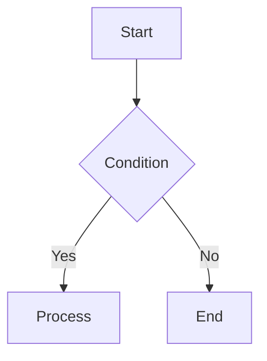
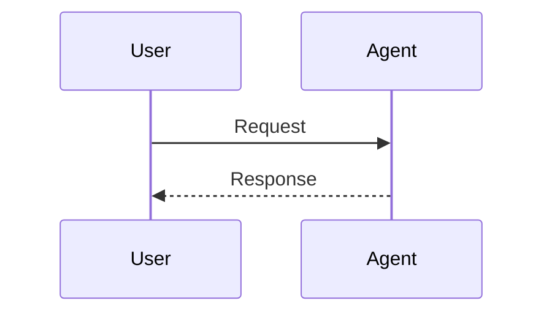
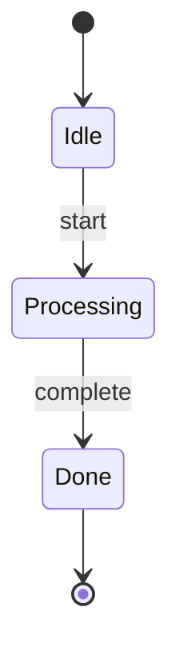

# Mermaid Generator

Automated diagram generation skill powered by mermaid-cli.

## Core Principles

1. **AskUserQuestion first** — gather diagram type (TD, LR, etc.), purpose, and content description
2. **Verify mermaid-cli** — `which mmdc || npm install -g @mermaid-js/mermaid-cli`
3. **Output to `.omb/docs/`** — `{name}.mmd` → `{name}.png`
4. **Use templates** — LangGraph patterns use templates; other types are generated freely
5. **Provide embed code** — after conversion, provide notebook/README embed instructions

## Workflow

### 1. Verify mermaid-cli installation
```bash
which mmdc || npm install -g @mermaid-js/mermaid-cli
mmdc --version
```

### 2. Gather requirements (AskUserQuestion)
- **Type**: flowchart / sequence / state / class
- **Purpose**: notebook embed / README / both
- **Description**: what flow or structure to visualize

### 3. Check templates
- LangGraph node flow → [langgraph-flow.mmd](templates/langgraph-flow.mmd)
- HITL decision flow → [hitl-decision.mmd](templates/hitl-decision.mmd)
- Agent sequence → [agent-sequence.mmd](templates/agent-sequence.mmd)
- No matching template → Claude generates the `.mmd` directly

### 4. Generate `.mmd` file
```bash
# Ensure output directory exists
mkdir -p .omb/docs

# Create .mmd file (use Write tool)
```

### 5. Convert to PNG (high resolution)
```bash
mmdc -i .omb/docs/{name}.mmd -o .omb/docs/{name}.png -s 2 -t default -b white
```

### 6. Report results
```
Generated successfully:
- Source: .omb/docs/{name}.mmd
- Image: .omb/docs/{name}.png (high resolution)

Notebook embed:


README embed:


Size adjustment if needed (HTML):

```

## Checklist

- [ ] Verify mmdc installation
- [ ] Gather requirements via AskUserQuestion
- [ ] Check templates or generate freely
- [ ] Create `.mmd` file in `.omb/docs/`
- [ ] Run PNG conversion (`mmdc -i ... -o ...`)
- [ ] Provide embed code

## Diagram Syntax Reference

### flowchart (most common)


### sequence


### state


## References

- **[templates/](templates/)** — LangGraph pattern templates
- **[references/style-guide.md](references/style-guide.md)** — Themes, colors, and style guide
