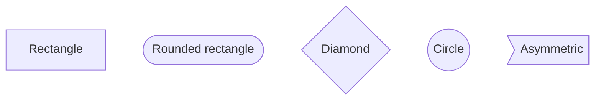

# Mermaid Style Guide

## Theme Options

| Theme | Command | Use Case |
|-------|---------|----------|
| default | `-t default` | Default light background (recommended) |
| dark | `-t dark` | Dark background |
| forest | `-t forest` | Green palette |
| neutral | `-t neutral` | Neutral gray |

## Background Color Options

```bash
# White background (recommended for notebooks)
mmdc -i input.mmd -o output.png -t default -b white

# Transparent background
mmdc -i input.mmd -o output.png -t default -b transparent

# Dark background
mmdc -i input.mmd -o output.png -t dark -b "#1a1a2e"
```

## Node Styles

### Basic Node Shapes


### LangGraph Recommended Patterns
- `([__start__])` — start node
- `([__end__])` — end node
- `[NodeName]` — regular node
- `{Condition}` — conditional branch

## Arrow Styles

```mermaid
flowchart LR
    A --> B           %% standard arrow
    C -->|label| D    %% labeled arrow
    E -.-> F          %% dotted arrow
    G ==> H           %% thick arrow
```

## Unicode Support

mermaid-cli supports Unicode characters natively. No additional font configuration required.

## Size Options

| Option | Default | Description |
|--------|---------|-------------|
| `-w, --width` | 800 | Page width (pixels) |
| `-H, --height` | 600 | Page height (pixels) |
| `-s, --scale` | 1 | Scale factor (2 = high resolution) |

## Output Formats

| Format | Command | Use Case |
|--------|---------|----------|
| PNG | `-o output.png` | Notebooks, general documents |
| SVG | `-o output.svg` | High resolution, scalable |
| PDF | `-o output.pdf` | Print-ready |

## Recommended Command

```bash
# Standard command (high resolution, retina-ready)
mmdc -i .omb/docs/{name}.mmd -o .omb/docs/{name}.png -s 2 -t default -b white
```

## Notebook/Document Embed

### Basic Embed (Markdown)

```markdown
<!-- Notebook -->


<!-- README -->

```

### Size Adjustment (HTML)

```html
<!-- Specify width -->


<!-- Center aligned -->
<p align="center">
  
</p>
```

**Recommended widths:**
- Full width: `width="800"`
- Medium: `width="600"` (recommended)
- Small: `width="400"`
