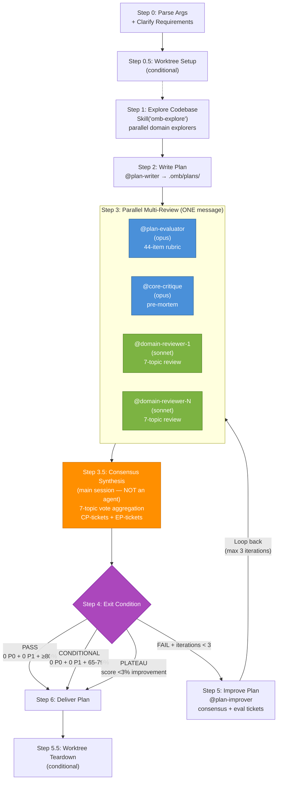

# Implementation Plan Authoring

Orchestrates the creation of structured implementation plans through a write → parallel multi-review → consensus → improve iteration loop. Produces Korean-language plan documents saved to `.omb/plans/` that serve as execution specs for domain orchestration skills (`omb-orch-*`).

## Architecture



**Legend:** Blue = mandatory reviewers (always included), Green = domain reviewers (keyword-based), Orange = main session consensus, Purple = exit decision.

## When to Apply

- Before any multi-domain implementation task
- When the user says "plan", "계획", "설계" or describes a feature to build
- When a task is broad or vague and needs decomposition
- When multiple agents or domains will be involved in implementation

## Write Permissions

**WRITE:** `.omb/plans/*.md` files ONLY
**READ:** Entire codebase, `docs/`, `.claude/agents/`, `.claude/skills/`, existing plans

## Step 0: Parse Arguments + Clarify Requirements

### Argument Parsing

```
omb-plan [--worktree] [feature or task description]
```

1. Check if the argument string contains `--worktree`
2. If yes: set `worktree_mode = true`, strip `--worktree` from the argument string
3. Pass the remaining string as the feature/task description

### Requirements Clarification

Before exploring or planning, ensure the requirements are clear. Use AskUserQuestion if the description is ambiguous:

**Questions to ask (present numbered options):**
1. Scope boundaries — What is in scope and out of scope?
2. Target users — Who will use this feature?
3. Integration points — Does this connect to existing systems?
4. Priority — If multiple features, what order?
5. Constraints — Performance, security, or compatibility requirements?

**Do NOT proceed until:**
- Core functionality is defined (what the feature does)
- Scope boundaries are clear (what it does NOT do)
- At least 2 measurable acceptance criteria can be written

**Skip Step 0 if:** The user's description is already specific with clear scope and acceptance criteria.

## Step 0.5: Worktree Setup (conditional)

**Only execute when `worktree_mode = true`.** Follow `.claude/rules/workflow/07-worktree-protocol.md`.

<execution_order>
1. Derive branch name: `{type}/{slug-from-description}`. Infer type from context (new feature → `feat/`, bug investigation → `fix/`). Default to `feat/`.
2. Run the worktree setup script:
   ```bash
   bash .claude/hooks/omb/omb-hook.sh WorktreeSetup {type}/{slug}
   ```
3. Enter the worktree and verify `pwd`:
   ```bash
   cd worktrees/{type}/{slug} && pwd
   ```
4. If setup fails or `pwd` mismatches: report BLOCKED and stop.
</execution_order>

Record `worktree_active = true`, `worktree_branch`, and `worktree_path` for Step 5.5.

## Step 1: Explore Codebase

Use the `omb-explore` exploration workflow to gather codebase context:

1. Analyze the requirements to detect relevant technical domains
2. Dispatch domain-specific explorers in parallel:
   - **Always:** @general-explorer + @doc-explorer
   - **By domain signal:** @api-explorer, @db-explorer, @ui-explorer, @ai-explorer, @electron-explorer, @infra-explorer
3. Aggregate findings into a unified report with `file:line` references

**Domain detection signals:**

| Signal | Explorer |
|--------|----------|
| API, endpoints, routes, REST, middleware | @api-explorer |
| Database, models, migrations, queries | @db-explorer |
| React, components, hooks, frontend, UI | @ui-explorer |
| LangGraph, AI, agents, prompts, RAG | @ai-explorer |
| Electron, IPC, desktop, preload | @electron-explorer |
| Docker, CI/CD, K8s, Terraform, deploy | @infra-explorer |

**Key docs to check:** `docs/architecture/`, `docs/api/`, `docs/database/` — always read via @doc-explorer.

## Step 2: Write Initial Plan

Spawn the `plan-writer` agent with:

```
Agent({
  subagent_type: "plan-writer",
  prompt: "Write an implementation plan for: {requirements}\n\nExploration findings:\n{aggregated findings from Step 1}\n\nSave to: .omb/plans/{date}-{name}.md"
})
```

The plan-writer produces a complete plan document following the template in `.claude/rules/workflow/01-plan-writing.md`:

1. 사용자 요구사항 (requirements, scope, acceptance criteria)
2. 기능 정의 및 기술 분석 (tech stack table with file:line refs)
3. TODO 체크리스트 (ordered by implementation sequence)
4. 구현 계획 상세 (phased breakdown with @agent and Skill() per task)
5. 아키텍처 다이어그램 (optional, via Skill("omb-mermaid"))
6. TDD 검증 계획 (coverage targets, test commands, via Skill("omb-tdd"))
7. 문서 업데이트 계획 (docs/ paths, via Skill("omb-doc"))
8. 리스크 및 확인 사항 (risks, user verification items)

**Wait for:** `<omb>DONE</omb>` with the plan file path in artifacts.

## Step 3: Parallel Multi-Review

Spawn all reviewers **in parallel** using multiple Agent() calls in a single message. This replaces the previous single-agent evaluation with a multi-perspective review that runs simultaneously.

### 3a. Domain Detection

Scan the plan's Sections 2, 3, and 4 for domain keywords. Match against the Reviewer Delegation Table below to determine which domain reviewers to include.

### 3b. Reviewer Delegation Table

<reviewer_delegation>

| Domain Signal (plan keywords) | Reviewer | Review Strengths | Key Review Focus |
|------|---------|-----------|-------------|
| *(always included)* | @plan-evaluator (opus) | Quantitative rubric scoring, 44-item checklist across 9 dimensions | Dimension scores, @agent/Skill() reference verification, file:line spot-checks, P0-P3 classification |
| *(always included)* | @core-critique (opus) | Architecture pre-mortem, assumption verification | Design contradictions, unverified assumptions, missing risk mitigation, edge case gaps, code-vs-claim verification |
| API, endpoints, REST, middleware, FastAPI, Express | @api-design (sonnet) | API contract design, REST/GraphQL architecture | Endpoint paths/methods/status codes, request/response schemas, auth/authz, error handling, rate limiting, pagination |
| Database, models, migrations, SQLAlchemy, Alembic, queries | @db-design (sonnet) | PostgreSQL schema and ORM design | Table definitions, index strategy (B-tree/GIN/GiST), migration safety, query optimization, JSONB patterns, Redis caching |
| React, components, hooks, frontend, Tailwind, UI | @ui-design (sonnet) | Component architecture and accessibility | Component tree, hook API, composition patterns, ARIA/keyboard accessibility, responsive layout, design tokens |
| LangGraph, LangChain, agents, prompts, RAG, AI | @ai-design (sonnet) | LLM workflow and agent architecture | Framework selection (LangChain/LangGraph/Deep Agents), state schema, node/tool design, prompt templates, RAG pipeline |
| Electron, IPC, preload, BrowserWindow, desktop | @electron-design (sonnet) | Electron IPC and security boundaries | IPC channel types, preload API surface, security config (contextIsolation/sandbox), window management |
| Docker, CI/CD, K8s, Terraform, deploy, infra | @infra-design (sonnet) | Infrastructure design | Container config, CI/CD pipelines, K8s manifests, Terraform modules, deployment strategy |
| Infrastructure cost, scaling, resilience | @infra-critique (sonnet) | Infrastructure cost/scalability/resilience critique | Security misconfigs, over-provisioning, single points of failure, monitoring coverage, compliance |
| Auth, OWASP, secrets, security | @security-audit (sonnet) | OWASP Top 10 audit | Injection, broken auth, sensitive data exposure, XSS, access control, dependency vulnerabilities, security logging |
| Code quality, testing, linting, refactoring | @code-review (sonnet) | Code correctness/security/performance review | Logic errors, N+1 queries, naming conventions, type correctness, edge cases, regressions |
| settings.json, CLAUDE.md, hooks, skills, agents, rules, harness | @harness-design (sonnet) | Claude Code harness config design | Agent frontmatter, skill structure, hook setup, permission design, MCP config, memory architecture |

</reviewer_delegation>

### 3c. Team Composition Rules

1. **@plan-evaluator + @core-critique always included** (mandatory 2)
2. Add domain reviewers based on keyword signals detected in the plan
3. **Minimum 3 reviewers** — if 0 domain reviewers detected, add @code-review + @security-audit as defaults
4. **Maximum 12 reviewers** — all available reviewers
5. **Do NOT include** reviewers for domains the plan does not mention (no over-staffing)

### 3d. Parallel Execution Pattern

Spawn ALL reviewers in ONE message with multiple Agent() calls:

<parallel_spawn_example>

**Correct — all Agent() calls in a single message (parallel):**

```
Agent({
  subagent_type: "plan-evaluator",
  prompt: "<review_context>Plan: .omb/plans/{file}.md</review_context>
Evaluate using omb-evaluation-plan rubric (44 items, 9 dimensions).
Verify @agent references exist in .claude/agents/omb/.
Verify Skill() references exist in .claude/skills/.
Spot-check file:line references.
Verify your verdict against the evidence before finalizing."
})

Agent({
  subagent_type: "core-critique",
  prompt: "<review_context>Plan: .omb/plans/{file}.md</review_context>
<role>You are an architecture critic specializing in pre-mortem analysis. Your strength is identifying design contradictions, unverified assumptions, missing risk mitigation, and edge case gaps. Verify every claim against actual codebase files.</role>
<review_topics>
[7-topic review prompt — see 3e below]
</review_topics>"
})

Agent({
  subagent_type: "api-design",  // only if API keywords detected
  prompt: "<review_context>Plan: .omb/plans/{file}.md</review_context>
<role>You are an API contract specialist. Your strength is reviewing endpoint design, request/response schemas, auth flows, error handling, and rate limiting strategies.</role>
<review_topics>
[7-topic review prompt — see 3e below]
</review_topics>"
})

// ... additional domain reviewers as detected
```

**Wrong — sequential Agent() calls across separate messages:**

```
// DO NOT DO THIS — spawns one at a time, wasting time
Agent({ subagent_type: "plan-evaluator", ... })
// wait for result
Agent({ subagent_type: "core-critique", ... })
// wait for result
Agent({ subagent_type: "api-design", ... })
```

</parallel_spawn_example>

### 3e. 7-Topic Review Prompt (for domain reviewers and @core-critique)

Each non-evaluator reviewer receives this structured prompt with XML tags:

```
<review_context>
Plan: .omb/plans/{file}.md
</review_context>

<role>
You are a {domain} specialist. Your review strengths: {strengths from delegation table}.
Focus your review on: {key review focus from delegation table}.
Stay within your domain — do not review aspects outside your expertise.
</role>

<review_topics>
Provide assessment on ALL 7 topics below. For each finding:
- Quote evidence from the plan (section reference or exact text)
- Assign severity: BLOCKING or NON-BLOCKING

### 1. KEEP — What should be preserved (strengths from your domain perspective)
### 2. REMOVE — What can be eliminated (unnecessary complexity)
### 3. MISSING — What needs to be added (gaps, missing safeguards)
### 4. AMBIGUOUS — What is unclear in intent (vague specs, ambiguous deliverables)
### 5. VIOLATIONS — What breaks rules or conventions
### 6. RISKS — Potential problems (failure modes, scalability concerns)
### 7. TDD — Test case opinions (missing scenarios, strategy gaps)

If a topic is not relevant to your domain, state "No findings from my perspective."
</review_topics>

<output_format>
For each topic, use this structure:

| # | Finding | Severity | Evidence |
|---|---------|----------|----------|
| 1 | {finding} | BLOCKING / NON-BLOCKING | "{quoted text from plan}" |

End with the standard omb output envelope.
</output_format>
```

### 3f. Wait for All

Wait for `<omb>DONE</omb>` from **all** reviewers before proceeding to Step 3.5. All reviewers run simultaneously — their independence is guaranteed by parallel execution (no reviewer can see another's output).

## Step 3.5: Consensus Synthesis

After all reviewer outputs are collected, the **main session** (NOT a sub-agent) synthesizes findings into a unified priority list.

### Synthesis Process

<consensus_process>

1. **Separate @plan-evaluator output** → extract score sheet + EP-tickets (EP-P{N}-{NNN})
2. **Collect domain reviewer outputs** → gather findings per topic from all reviewers
3. **Per topic (7 topics):**
   a. Deduplicate findings that reference the same plan element
   b. Count how many reviewers flagged each unique finding
   c. Classify by consensus level:

| Consensus Level | Criterion | Priority |
|----------------|-----------|----------|
| **Unanimous** | All reviewers agree | P0 (critical) |
| **Supermajority** | ≥75% of reviewers agree | P0 (critical) |
| **Majority** | >50% of reviewers agree | P0 (critical) |
| **Strong minority** | 33-50% of reviewers agree | P1 (high) |
| **Minority** | <33% of reviewers agree | P2 (medium) |
| **Single voice** | Only 1 reviewer flags | P3 (low) |

4. **Apply veto power:**
   - @core-critique BLOCKING finding → minimum P1 (even without majority)
   - @security-audit BLOCKING finding → minimum P1 (even without majority)
5. **Resolve conflicts:**
   - Majority position becomes the recommendation
   - Minority position recorded as dissenting view with rationale
   - **50/50 splits → escalate to user** via AskUserQuestion (do NOT auto-resolve)
6. **Merge with evaluation tickets:**
   - If consensus finding overlaps with EP-ticket, merge (use higher priority)
   - Ticket ID prefixes: `CP-P{N}-{NNN}` (consensus), `EP-P{N}-{NNN}` (evaluation)
   - See `.claude/rules/workflow/09-ticket-schema.md` for canonical ticket format

</consensus_process>

### Synthesis Output

Per topic, produce:

```
### Topic N: {TOPIC NAME}

**Consensus findings ({count} items):**

| # | Finding | Flagged By | Consensus | Priority | Evidence |
|---|---------|-----------|-----------|----------|----------|
| 1 | {finding} | @agent1, @agent2, @agent3 | Majority (3/5) | P0 | "{quoted text}" |
| 2 | {finding} | @agent1 | Single voice | P3 | "{quoted text}" |

**Dissenting views (if any):**
- @agent2 disagrees with finding #1 because: {rationale}
```

## Step 4: Check Exit Condition

P0/P1 counts include **both** consensus-derived (CP-) and evaluation-derived (EP-) tickets.

| Condition | Action |
|-----------|--------|
| **PASS** — 0 P0 + 0 P1 + score ≥80% | Deliver final plan to user. Report iteration summary. |
| **CONDITIONAL PASS** — 0 P0 + 0 P1 + score 65-79% | Deliver plan with P2/P3 notes. Ask user if improvements needed. |
| **FAIL** + iterations < 3 | Proceed to Step 5 (improve). |
| **FAIL** + iterations = 3 | Deliver best version with unresolved ticket list. Report FAIL. |
| **PLATEAU** (see below) | Stop early. Explain why. Deliver best version. |

### Plateau Detection

Stop early when improvement has stalled. Three signals:

| Signal | Criterion | Action |
|--------|-----------|--------|
| **Score plateau** | Overall score improves <3% AND no P0/P1 resolved this iteration | Stop — diminishing returns |
| **Issue plateau** | Same P0/P1 issues remain open after fix attempt | Stop — root cause needs user input |
| **Oscillation** | Issue resolved in round N reappears as FAIL in round N+1 | Stop — fix is introducing regressions |

## Step 5: Improve Plan

Spawn the `plan-improver` agent with consensus findings AND evaluation tickets:

```
Agent({
  subagent_type: "plan-improver",
  prompt: "Improve the plan at: .omb/plans/{file}.md

Review team consensus findings:
{Full consensus synthesis from Step 3.5, organized by priority}

Evaluation results from @plan-evaluator:
Score: {score}% (Grade {grade})
{EP-P0 through EP-P3 tickets}

Priority order:
1. Fix consensus P0 items first (majority-agreed critical issues)
2. Fix consensus P1 items
3. Fix evaluation P0/P1 items not already covered by consensus
4. P2/P3 only if P0/P1 are all resolved

Use omb-improve-plan fix strategies. Diagnose root causes first. Produce regression diff table."
})
```

**Wait for:** `<omb>DONE</omb>` with regression diff table confirming 0 regressions.

Then **loop back to Step 3** for re-evaluation with the full parallel review team.

## Step 5.5: Worktree Teardown (conditional)

**Only execute when `worktree_active = true`.** Follow `.claude/rules/workflow/07-worktree-protocol.md`.

<execution_order>
1. Ask the user via `AskUserQuestion`:
   ```
   Plan authoring complete in worktree branch `{worktree_branch}`.
   The plan file needs to be in the main tree for /omb-run to find it.
   Recommended action: Merge
   Options:
   1. Merge — merge changes into the original branch, then remove worktree
   2. Keep — keep worktree for manual review
   3. Discard — remove worktree and delete branch
   ```
2. Execute chosen action:
   - **Merge**: `cd {project-root} && git merge {worktree_branch}` then `bash .claude/hooks/omb/omb-hook.sh WorktreeTeardown {worktree_branch} --delete-branch`
   - **Keep**: `cd {project-root}`
   - **Discard**: `cd {project-root} && bash .claude/hooks/omb/omb-hook.sh WorktreeTeardown {worktree_branch} --delete-branch`
3. Verify return: run `pwd` and confirm CWD is back at the original project root.
</execution_order>

## Step 6: Deliver Final Plan

After exit condition is met, present the iteration summary to the user:

```
## Plan 작성 완료

**파일:** .omb/plans/YYYY-MM-DD-name.md
**최종 점수:** XX% (Grade X)
**반복 횟수:** N
**리뷰 팀:** {N}명 ({@agent1, @agent2, ...})

### 반복 이력

| 반복 | 점수 | 등급 | P0 | P1 | P2 | P3 | 리뷰어 수 | 주요 변경 사항 |
|------|------|------|----|----|----|----|-----------|-----------| 
| 초안  | XX%  | X    | X  | X  | X  | X  | N         | —         |
| 1차   | XX%  | X    | X  | X  | X  | X  | N         | [...]     |
| 최종  | XX%  | X    | X  | X  | X  | X  | N         | [...]     |

### 미해결 이슈 (있는 경우)
- CP-P2-001: {description}
- EP-P3-001: {description}
```

## Context Passing Rules

Each agent receives context independently — no reviewer sees another reviewer's output.

| Agent | Receives |
|-------|----------|
| @plan-writer (Step 2) | User requirements + omb-explore aggregated findings |
| @plan-evaluator (Step 3) | Plan file path only (reads independently) |
| @core-critique (Step 3) | Plan file path only (reads independently) |
| @{domain-reviewers} (Step 3) | Plan file path only (reads independently) |
| Main session (Step 3.5) | All reviewer outputs + evaluation output |
| @plan-improver (Step 5) | Plan file path + consensus synthesis summary + evaluation tickets |

**Critical:** Pass the consensus synthesis (from Step 3.5) and full evaluation output (score sheet + all tickets) to plan-improver. The improver needs ticket IDs, evidence, and remediation hints to apply targeted fixes. On subsequent iterations, pass only the **previous consensus summary** — not the full reviewer outputs — to preserve token budget.

## Agent Inventory

### Plan Authoring Agents

| Agent | Model | Role | Write Access |
|-------|-------|------|-------------|
| @plan-writer | opus | Write initial plan draft | `.omb/plans/` only |
| @plan-improver | opus | Fix evaluation + consensus issues | `.omb/plans/` only |

### Review Team Candidates

| Agent | Model | Mandatory? | Review Strengths | Key Review Focus |
|-------|-------|-----------|-----------|-------------|
| @plan-evaluator | opus | Yes | Quantitative rubric scoring, 44-item checklist | 9 dimension scores, reference verification, P0-P3 classification |
| @core-critique | opus | Yes | Architecture pre-mortem, assumption verification | Design contradictions, unverified assumptions, risk gaps, edge cases |
| @api-design | sonnet | If API detected | API contract design, REST/GraphQL architecture | Endpoints, schemas, auth, error handling, rate limiting |
| @db-design | sonnet | If DB detected | PostgreSQL schema and ORM design | Tables, indexes, migration safety, query optimization |
| @ui-design | sonnet | If UI detected | Component architecture, accessibility | Component tree, hooks, ARIA, responsive layout |
| @ai-design | sonnet | If AI detected | LLM workflow and agent architecture | Framework selection, state schema, tools, prompts, RAG |
| @electron-design | sonnet | If Electron detected | Electron IPC and security boundaries | IPC channels, preload API, security config |
| @infra-design | sonnet | If infra detected | Infrastructure design | Containers, CI/CD, K8s, Terraform, deployment |
| @infra-critique | sonnet | If infra cost/scale detected | Infra cost/scalability/resilience critique | Over-provisioning, SPOFs, monitoring, compliance |
| @security-audit | sonnet | If security detected | OWASP Top 10 audit | Injection, auth, data exposure, XSS, access control |
| @code-review | sonnet | If code quality detected | Code correctness/security/performance | Logic errors, N+1, conventions, type correctness |
| @harness-design | sonnet | If harness detected | Claude Code harness config design | Agent frontmatter, skills, hooks, permissions, MCP |

### Supporting Explorer Agents

| Agent | Model | Domain |
|-------|-------|--------|
| @general-explorer | sonnet | Project structure, configs, entry points |
| @api-explorer | sonnet | API routes, handlers, middleware |
| @db-explorer | sonnet | ORM models, migrations, queries |
| @ui-explorer | sonnet | React components, hooks, styles |
| @ai-explorer | sonnet | LangGraph, tools, prompts, RAG |
| @electron-explorer | sonnet | Main/renderer process, IPC |
| @infra-explorer | sonnet | Docker, CI/CD, K8s, Terraform |
| @doc-explorer | sonnet | docs/ folder, README, ADRs |

## Anti-Patterns

- **Sequential reviewer spawning** — Spawn all reviewers in a single message for parallel execution. **Why:** Sequential spawning wastes time proportional to reviewer count and provides no quality benefit since reviewers must be independent anyway.
- **Passing reviewer outputs to other reviewers** — Each reviewer must assess the plan independently. **Why:** Sharing reviews causes anchoring bias and groupthink, reducing the diversity of perspectives that multi-review is designed to provide. Parallel execution naturally prevents this.
- **Skipping exploration** — Always run omb-explore before plan-writer. **Why:** Plans without codebase context miss existing patterns and utilities, leading to redundant or incompatible designs.
- **Over-iterating** — If the plan reaches 80%+ with 0 P0/P1, deliver it. **Why:** Diminishing returns — each additional iteration costs N parallel agent spawns with decreasing marginal improvement.
- **Vague requirements acceptance** — Don't proceed to Step 1 with "implement the thing". **Why:** Vague requirements cascade into vague plans that fail evaluation, wasting multiple review cycles.
- **Manual plan evaluation** — Always use @plan-evaluator for quantitative scoring. **Why:** Human review is complementary, not a replacement for rubric-based consistency.
- **Modifying code during planning** — The planning workflow is read-only for source code. Only `.omb/plans/` files are written.
- **Over-staffing the review team** — Only include reviewers for domains the plan actually touches. **Why:** Including all 12 reviewers for a single-domain plan wastes tokens and dilutes consensus signal.
- **Auto-resolving 50/50 splits** — When reviewers are evenly split, escalate to the user. **Why:** Even splits indicate genuine ambiguity that requires human judgment.

## Rules

- **Parallel reviewer dispatch** — All reviewers in Step 3 spawn via multiple Agent() calls in ONE message. Independence is naturally guaranteed by parallel execution.
- **Parallel explorer dispatch** — Explorers in Step 1 run in parallel via multiple Agent() calls in one message.
- **Sequential plan agents** — plan-writer → [parallel review] → consensus → plan-improver. Each depends on the previous output.
- **Main-session consensus** — Step 3.5 synthesis is performed by the main session, NOT a sub-agent. Per CLAUDE.md rule #2, only the main session spawns agents.
- **Majority = P0** — Any finding flagged by >50% of reviewers is automatically P0 (critical).
- **Veto power** — @core-critique BLOCKING = minimum P1, @security-audit BLOCKING = minimum P1, regardless of vote count.
- **Ticket ID prefixes** — Consensus: `CP-P{N}-{NNN}`. Evaluation: `EP-P{N}-{NNN}`. See `.claude/rules/workflow/09-ticket-schema.md` for canonical schema.
- **Max 3 review-improvement iterations** — After 3 rounds, deliver the best version regardless of score.
- **Token budget on iteration** — On re-review (iteration 2+), pass only the previous consensus summary to plan-improver, not the full reviewer outputs.
- **Korean plan output, English skill content** — Per `language-settings.md`.
- **AskUserQuestion actively** — Clarify early, not after 2 failed iterations.
