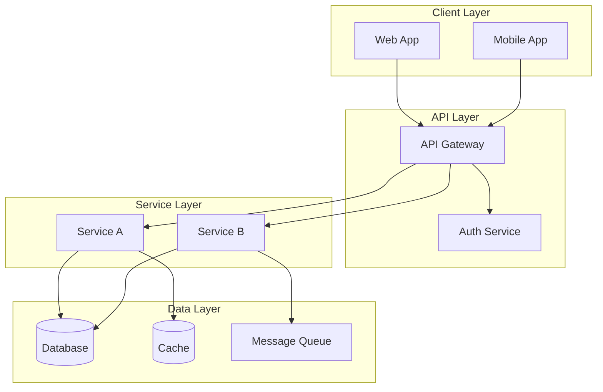
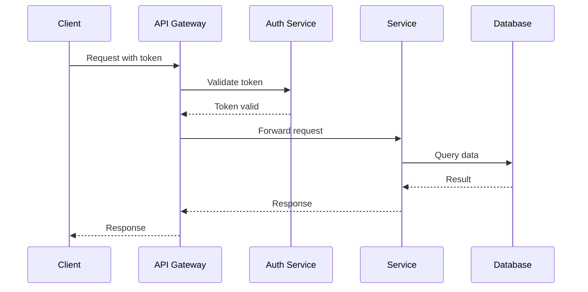
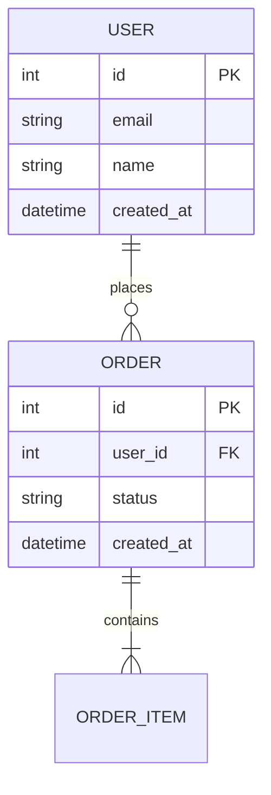
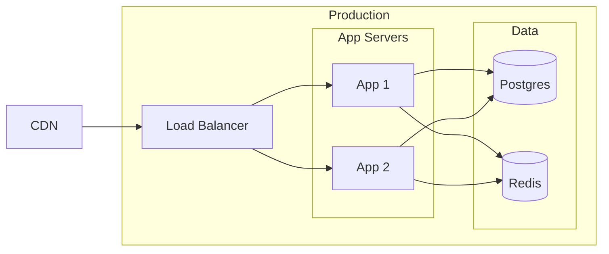

# Technical Report Reference

## § 1 — Explorer Prompt Templates

Each explorer agent receives this base prompt with domain-specific parameters.

### Base Template

```
Explore the project at {TARGET_PATH} from the {DOMAIN} perspective.

## Project Context (from PROJECT.md / CLAUDE.md)
{PROJECT_CONTEXT}

Use this context to understand the project's purpose, architecture, and conventions before exploring. It helps you prioritize findings and understand how components relate to the bigger picture.

Your goal: identify all relevant {DOMAIN_ITEMS} and produce structured findings.

Search patterns: {GLOB_PATTERNS}
Focus areas: {FOCUS_AREAS}

For each finding, report:
1. **File**: exact file path and line range
2. **Category**: {CATEGORIES}
3. **Summary**: one-sentence description
4. **Detail**: 2-3 sentences explaining what it does, how it works, and why it matters
5. **Code snippet**: relevant code excerpt (max 20 lines)
6. **Relationships**: what other components it interacts with

Maximum 20 findings. Prioritize by importance (core functionality > utilities > config).
Report in {REPORT_LANGUAGE}.
```

### Domain Parameters

**Backend Explorer**
- DOMAIN: Backend Services
- DOMAIN_ITEMS: services, controllers, middleware, business logic modules
- GLOB_PATTERNS: `**/api/**`, `**/routes/**`, `**/services/**`, `**/controllers/**`, `**/middleware/**`, `**/*.py`, `**/src/**/*.ts`
- FOCUS_AREAS: service architecture, dependency injection, error handling patterns, configuration management, logging
- CATEGORIES: service, middleware, utility, config, model

**Frontend Explorer**
- DOMAIN: Frontend UI
- DOMAIN_ITEMS: components, pages, hooks, state management, routing
- GLOB_PATTERNS: `**/components/**`, `**/*.tsx`, `**/*.jsx`, `**/pages/**`, `**/app/**`, `**/hooks/**`, `**/store/**`
- FOCUS_AREAS: component hierarchy, state management patterns, routing structure, build configuration, design system usage
- CATEGORIES: component, page, hook, store, config, style

**API Explorer**
- DOMAIN: API Design
- DOMAIN_ITEMS: endpoints, route definitions, request/response types, OpenAPI specs, middleware chains
- GLOB_PATTERNS: `**/routes/**`, `**/api/**`, `**/controllers/**`, `**/openapi*`, `**/swagger*`, `**/*.yaml`, `**/*.json`
- FOCUS_AREAS: endpoint inventory (HTTP method + path), request/response schemas, authentication patterns, error response formats, rate limiting, versioning
- CATEGORIES: endpoint, schema, auth, error, middleware

**DB Explorer**
- DOMAIN: Database Design
- DOMAIN_ITEMS: schemas, migrations, ORM models, query patterns, seed data
- GLOB_PATTERNS: `**/migrations/**`, `**/models/**`, `**/*.sql`, `**/schema*`, `**/prisma/**`, `**/alembic/**`, `**/drizzle/**`
- FOCUS_AREAS: table/collection definitions, relationships (FK, indexes), migration patterns, query builders, connection pooling
- CATEGORIES: schema, migration, model, query, config

**Infra Explorer**
- DOMAIN: Infrastructure
- DOMAIN_ITEMS: deployment configs, CI/CD pipelines, container definitions, cloud configs
- GLOB_PATTERNS: `Dockerfile*`, `docker-compose*`, `.github/workflows/**`, `**/ci/**`, `*.tf`, `**/k8s/**`, `**/deploy/**`, `Makefile`, `*.yaml`
- FOCUS_AREAS: deployment topology, CI/CD pipeline stages, container configuration, environment management, monitoring/alerting setup
- CATEGORIES: container, ci-cd, deploy, monitoring, config

**Security Explorer**
- DOMAIN: Security
- DOMAIN_ITEMS: auth modules, middleware guards, secret management, dependency manifests
- GLOB_PATTERNS: `**/auth/**`, `**/security/**`, `**/middleware/**`, `**/guard*`, `.env*`, `**/rbac/**`, `package.json`, `pyproject.toml`, `go.mod`
- FOCUS_AREAS: authentication flows (JWT, OAuth, session), authorization models (RBAC, ABAC), secret management, CORS configuration, dependency vulnerabilities
- CATEGORIES: auth, authorization, secrets, cors, dependency

**General Explorer**
- DOMAIN: Project Structure
- DOMAIN_ITEMS: project layout, configuration files, dependency manifests, documentation
- GLOB_PATTERNS: `README*`, `CHANGELOG*`, `package.json`, `pyproject.toml`, `go.mod`, `tsconfig*`, `*.config.*`, `.env.example`
- FOCUS_AREAS: project structure and organization, tech stack detection, naming conventions, build system, monorepo structure, dependency graph
- CATEGORIES: structure, config, dependency, documentation, convention

---

## § 2 — Clustering Rules

### File Path Routing

| Path Pattern | Category |
|-------------|----------|
| `**/api/**`, `**/routes/**`, `**/controllers/**` (route definitions) | api |
| `**/api/**`, `**/services/**`, `**/controllers/**` (business logic) | backend |
| `**/components/**`, `**/*.tsx`, `**/pages/**`, `**/app/**` | frontend |
| `**/migrations/**`, `**/models/**`, `**/*.sql`, `**/schema*` | database |
| `Dockerfile*`, `docker-compose*`, `.github/**`, `**/ci/**` | infrastructure |
| `**/auth/**`, `**/security/**`, `**/middleware/auth*` | security |

### Keyword Routing

| Keywords in Finding | Category |
|--------------------|----------|
| architecture, design pattern, component diagram, system design, data flow | architecture |
| endpoint, route, HTTP, request, response, REST, GraphQL, OpenAPI | api |
| service, middleware, controller, business logic, handler | backend |
| component, hook, state, render, UI, page, layout | frontend |
| table, column, schema, migration, index, query, ORM, relation | database |
| deploy, CI/CD, Docker, container, pipeline, monitoring | infrastructure |
| auth, token, JWT, OAuth, RBAC, permission, secret, CORS | security |
| feature, user flow, operation, use case, functionality | features |
| pattern, anti-pattern, debt, improvement, convention, best practice | lessons-learned |
| risk, vulnerability, failure, mitigation, threat | risks |

### Cross-Classification Rules

- A finding may belong to multiple categories. Assign to the PRIMARY category based on the strongest match.
- Security-related API endpoints go to `security`, not `api`.
- Database migration configs go to `database`, not `infrastructure`.
- Auth middleware goes to `security`, not `backend`.

---

## § 3 — Document Templates

### Architecture Document Template

```markdown
# Architecture: {SECTION_TITLE}

## Overview
{2-3 paragraph description of this architectural aspect}

## System Architecture Diagram

\```mermaid
{MERMAID_DIAGRAM}
\```

## Components

### {Component Name}
- **Purpose**: {what it does}
- **Technology**: {tech stack used}
- **Location**: `{file_path}`
- **Dependencies**: {what it depends on}
- **Dependents**: {what depends on it}

## Design Patterns
| Pattern | Where Used | Rationale |
|---------|-----------|-----------|
| {pattern} | {location} | {why} |

## Data Flow
{Description of how data moves through this part of the system}

## Trade-offs & Decisions
| Decision | Chosen | Alternative | Rationale |
|----------|--------|-------------|-----------|
| {decision} | {choice} | {alternative} | {why} |
```

### API Document Template

```markdown
# API: {SECTION_TITLE}

## Endpoint Inventory

| # | Method | Path | Auth | Description |
|---|--------|------|------|-------------|
| 1 | GET | /api/... | Bearer | ... |

## {Endpoint Group Name}

### {METHOD} {PATH}

**Description**: {what it does}

**Authentication**: {auth requirement}

**Request**:
- Headers: {required headers}
- Body: {request schema}

**Response**:
- `200`: {success response schema}
- `400`: {error response}
- `401`: {unauthorized}

**Example** (if depth level includes examples):
\```json
{example request/response}
\```

## Error Handling
| Code | Meaning | Response Shape |
|------|---------|---------------|
| 400 | Bad Request | `{ error: { code, message } }` |

## Authentication Patterns
{Description of auth patterns used across the API}
```

### Risk Document Template

```markdown
# Risks: {SECTION_TITLE}

## Risk Matrix

| ID | Category | Severity | Description | Impact | Likelihood | Mitigation |
|----|----------|----------|-------------|--------|-----------|------------|
| R-001 | {category} | P0 | ... | ... | High | ... |

## P0 — Critical Risks (Immediate Action Required)

### R-{NNN}: {Risk Title}
- **Category**: {security / performance / reliability / data integrity}
- **Description**: {detailed description}
- **Impact**: {what happens if this materializes}
- **Affected Files**: `{file_paths}`
- **Current Mitigation**: {existing safeguards, if any}
- **Recommended Action**: {specific steps to mitigate}
- **Effort**: {low / medium / high}

## Improvement Roadmap

| Priority | Risk ID | Action | Effort | Expected Outcome |
|----------|---------|--------|--------|-----------------|
| 1 | R-001 | ... | Medium | ... |
```

### Lessons Learned Template

```markdown
# Lessons Learned: {SECTION_TITLE}

## Good Patterns Found

### {Pattern Name}
- **Where**: `{file_path}:{line}`
- **What**: {description of the pattern}
- **Why it works**: {explanation of benefits}
- **Example**:
\```{lang}
{code snippet}
\```

## Anti-Patterns Found

### {Anti-Pattern Name}
- **Where**: `{file_path}:{line}`
- **What**: {description of the issue}
- **Why it's problematic**: {explanation of risks}
- **Suggested improvement**: {how to fix it}

## Technical Debt Inventory

| # | Area | Description | Severity | Effort to Fix |
|---|------|-------------|----------|--------------|
| 1 | ... | ... | Medium | 2-3 days |

## Improvement Suggestions
{Prioritized list of improvements based on findings}
```

---

## § 4 — Mermaid Diagram Templates

### System Architecture (C4-style)



### Sequence Diagram (API Flow)



### ER Diagram (Database)



### Deployment Topology



---

## § 5 — Risk Matrix Template

### Severity Definitions

| Severity | Label | Definition | Response Time |
|----------|-------|-----------|---------------|
| P0 | Critical | System down, data loss, security breach | Immediate |
| P1 | High | Major feature broken, performance degradation >50%, auth bypass | Within 1 sprint |
| P2 | Medium | Minor feature broken, code quality issue, missing validation | Schedule in backlog |
| P3 | Low | Style issues, minor optimization, documentation gap | Nice to have |

### Risk Categories

| Category | Examples |
|----------|---------|
| Security | Auth bypass, injection, XSS, secrets exposure, dependency CVEs |
| Reliability | Single point of failure, missing error handling, no retry logic |
| Performance | N+1 queries, missing indexes, memory leaks, no caching |
| Data Integrity | Missing validation, no transactions, race conditions |
| Scalability | Hardcoded limits, synchronous bottlenecks, no horizontal scaling |
| Maintainability | Complex code, missing tests, tight coupling, no documentation |

---

## § 6 — Master Document Template (PROJECT-REPORT.md)

```markdown
# {PROJECT_NAME} — Technical Report

> Generated: {YYYY-MM-DD}
> Target: `{TARGET_PATH}`
> Language: {REPORT_LANGUAGE}

## Project Overview

{2-3 paragraphs describing what the project does, its purpose, and key characteristics}

## Tech Stack

| Layer | Technology | Version |
|-------|-----------|---------|
| Language | {languages} | {versions} |
| Framework | {frameworks} | {versions} |
| Database | {databases} | {versions} |
| Infrastructure | {infra tools} | — |

## Architecture Overview

\```mermaid
{HIGH_LEVEL_ARCHITECTURE_DIAGRAM}
\```

## Key Features

| # | Feature | Description | Documents |
|---|---------|-------------|-----------|
| 1 | {feature} | {brief description} | [Details](features/01-feature-definitions.md) |

## Risk Summary

| Severity | Count | Top Risk |
|----------|-------|----------|
| P0 (Critical) | {N} | {top risk description} |
| P1 (High) | {N} | {top risk description} |
| P2 (Medium) | {N} | — |
| P3 (Low) | {N} | — |

[Full Risk Report](risks/01-risk-matrix.md)

## Document Index

| # | Domain | Documents | Description |
|---|--------|-----------|-------------|
| 1 | Architecture | [01-system-overview](architecture/01-system-overview.md) | System design and component relationships |
| 2 | Backend | [01-service-architecture](backend/01-service-architecture.md) | Service layer and middleware |
| ... | ... | ... | ... |

---

*Technical report generated by oh-my-braincrew `omb-technical-report`*
```

---

## § 7 — Doc-Writer Agent Prompt Template

```
You are writing a technical report document for the "{CATEGORY}" domain.

**Project**: {TARGET_PATH}
**Language**: Write ALL content in {REPORT_LANGUAGE}
**Output directory**: {OUTPUT_DIR}
**Max lines per file**: 500 (split into multiple numbered files if needed)

## Project Context (from PROJECT.md / CLAUDE.md)
{PROJECT_CONTEXT}

Use this context to understand the project's purpose, architecture decisions, and conventions. It provides the "why" behind the code — reference it when explaining design decisions, trade-offs, and architectural patterns.

## Table of Contents (confirmed by user)
{TOC}

## Findings from code exploration
{FINDINGS}

## Document template to follow
{TEMPLATE_FROM_SECTION_3}

## Instructions

1. Read the relevant source files referenced in the findings to verify accuracy
2. Follow the document template structure from the TOC
3. Include mermaid diagrams where the TOC specifies them
4. Use code snippets from the actual source files (not fabricated examples)
5. Write numbered files: 01-{first-topic}.md, 02-{second-topic}.md, etc.
6. If a single file would exceed 500 lines, split into additional files
7. Cross-reference other domain documents where relationships exist
8. For risks: use P0-P3 severity levels with the format from reference.md § 5
9. Verify all file paths referenced in the document actually exist

Write the documents now. Save each file to {OUTPUT_DIR}/{NN}-{slug}.md.
```
