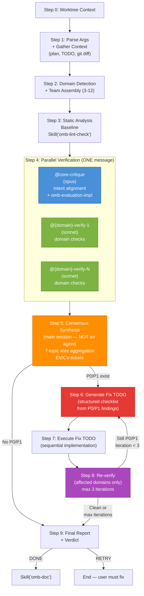

# Implementation Verification (Multi-Agent Consensus)

Orchestrates a multi-agent verification team to validate implementation results against the original plan. Uses parallel domain-specific verifiers plus architectural intent checking, then synthesizes consensus findings using the 7-topic framework. Auto-fixes P0/P1 issues with up to 3 iteration rounds.

This skill runs after `omb-run` has completed. It is the quality gate between implementation and documentation/PR creation.

Output language follows `$OMB_DOCUMENTATION_LANGUAGE` (`en` default, `ko` for Korean).

## Architecture



**Legend:** Blue = mandatory verifier, Green = domain verifiers, Orange = main session consensus, Purple = verdict decision, Red = fix loop.

## When to Apply

- After `omb-run` has completed execution of a plan
- When the user says "verify", "check implementation", "validate results", "verify plan results"
- Before creating a PR (`omb-pr`) to ensure quality gates pass
- When the user wants multi-agent consensus on implementation quality

## Write Permissions

**WRITE:** Source code files ONLY via `@{domain}-implement` agents in Step 6 (fix loop)
**READ:** Entire codebase, `.omb/plans/`, `.omb/todo/`, `.claude/agents/`, `.claude/rules/`

## Step 0: Worktree Context

Invoke `Skill("omb-worktree")` with argument `"context"`:
- **Single active worktree** -> cd into it, proceed
- **No active worktree** -> work on main
- **Multiple active worktrees** -> ask user to choose via AskUserQuestion

## Step 1: Parse Arguments + Gather Context

### Argument Parsing

```
omb-verify [plan-file-path] [--domain <filter>]
```

1. **Plan file resolution:**
   - If argument provided: verify the file exists at `.omb/plans/{argument}` (or as an absolute path)
   - If no argument: list files in `.omb/plans/` and ask user to select one via AskUserQuestion
   - If file does not exist: report error and list available plans

2. **TODO tracker resolution:**
   - Look for matching TODO file in `.omb/todo/` by matching the plan filename
   - If not found: report BLOCKED — `omb-run` must complete first
   - If found but status is not COMPLETE: warn the user that verification is on incomplete work

3. **Changed files collection:**
   - Parse `changed_files` from the TODO tracker task log (all `Artifacts:` entries)
   - Run `git diff --name-only` against the base branch as a cross-check
   - Union both file lists for comprehensive coverage

4. **Plan context extraction:**
   - Read Section 1.4 (acceptance criteria) — these are the primary verification targets
   - Read Section 3 (TODO checklist) — for completeness checking
   - Read Section 4 (implementation details) — for deliverables list
   - Read Section 6 (TDD plan) — for test coverage expectations

5. **Optional domain filter:**
   - If `--domain <filter>` specified: restrict verification to that domain's files only
   - Valid filters: `api`, `db`, `ui`, `ai`, `electron`, `infra`, `harness`

## Step 2: Domain Detection + Team Assembly

### File Pattern to Domain Mapping

Scan the changed files list and classify each file into a domain:

| File Pattern | Domain | Verifier |
|-------------|--------|----------|
| `*.py` in `apps/api/`, `src/api/` | API | @api-verify |
| `*.py` in `apps/ai/`, `src/ai/` | AI | @ai-verify |
| `*.ts`, `*.tsx` in `apps/web/`, `src/components/`, `src/pages/` | UI | @ui-verify |
| `alembic/`, `migrations/`, `**/models.py`, `**/models/` | DB | @db-verify |
| `Dockerfile*`, `docker-compose*`, `*.tf`, `.github/workflows/`, `infra/` | Infra | @infra-verify |
| Electron-related: `src/main/`, `src/renderer/`, `src/preload/` | Electron | @electron-verify |
| `.claude/`, `CLAUDE.md`, `.claude/agents/`, `.claude/skills/`, `.claude/rules/` | Harness | @harness-verify |

### Team Composition Rules

1. **@core-critique is ALWAYS included** — mandatory intent alignment checker (loads `omb-evaluation-impl` skill)
2. **Add domain verifiers** based on detected file patterns above
3. **Minimum team size: 3** — @core-critique + at least 2 domain verifiers. If fewer than 2 domains detected, add @code-review and @security-audit as defaults
4. **Maximum team size: 12** — do not exceed this
5. **Add @security-audit** if: security-sensitive files changed (auth/, middleware/, crypto/) OR >10 files changed
6. **Add @code-review** if: fewer than 3 domain verifiers selected (ensures minimum review breadth)
7. **All verifiers run in parallel** — spawn all in a single message
8. **Never include implement agents** — verification team is read-only only
9. **If `--domain` filter active**: only include matching verifier(s) + @core-critique (skip team minimum)

### Team Announcement

Before spawning verifiers, announce the assembled team:

```
## Verification Team Assembled

**Plan:** .omb/plans/{file}.md
**TODO:** .omb/todo/{file}.md
**Changed files:** {N} files across {M} domains
**Team size:** {T} verifiers

| # | Verifier | Role | Trigger |
|---|---------|------|---------|
| 1 | @core-critique | Intent alignment + architecture | Always included |
| 2 | @api-verify | API type check, lint, tests | {N} API files changed |
| 3 | @db-verify | Schema, migration, query check | {N} DB files changed |
| ... | ... | ... | ... |

Proceeding with static analysis baseline followed by parallel verification.
```

## Step 3: Static Analysis Baseline

Run `Skill("omb-lint-check")` in the main session before spawning verifiers:

1. Invoke `Skill("omb-lint-check")` targeting the changed files from Step 1
2. Record results: PASS/FAIL with specific file:line issues
3. Store lint results to pass to each verifier as context (prevents redundant lint work)

**If lint FAIL:** Do NOT stop. Continue to Step 4 — lint failures will be included in consensus synthesis as automatic EV-P1 minimum tickets.

## Step 4: Parallel Verification Team

Spawn ALL verifiers **in parallel** using multiple Agent() calls in a single message. Each verifier receives the same context package independently.

### Context Package (passed to every verifier)

```
<verification_context>
Plan: .omb/plans/{file}.md
Acceptance Criteria (Section 1.4):
{acceptance criteria list}

TODO Tracker: .omb/todo/{file}.md
Task Completion: {completed}/{total} tasks

Changed Files:
{list of changed files}

Lint Baseline:
{lint results from Step 3 — PASS/FAIL with file:line details}
</verification_context>
```

### @core-critique Prompt

```
Agent({
  subagent_type: "core-critique",
  model: "opus",
  prompt: "<verification_context>
{context package}
</verification_context>

<role>
You are verifying that the implementation matches the plan's INTENT, not just its letter.
Load Skill('omb-evaluation-impl') for the quantitative rubric.

Your responsibilities:
1. Score the implementation against the omb-evaluation-impl rubric (6 dimensions, ~30 items)
2. Verify every acceptance criterion (Section 1.4) is satisfied in actual code
3. Check that architecture decisions (Section 2.1) were followed
4. Identify scope creep (work done outside plan)
5. Identify missing work (plan items not implemented)
6. Read the actual code files — do not rely on TODO tracker status alone
</role>

<verification_topics>
Provide assessment on ALL 7 topics. For each finding, cite file:line evidence and assign severity (BLOCKING / NON-BLOCKING).

### 1. KEEP — What was implemented correctly (matches plan intent)
### 2. REMOVE — What was added beyond plan scope (scope creep)
### 3. MISSING — What plan items were not implemented
### 4. AMBIGUOUS — Where implementation diverges from plan in unclear ways
### 5. VIOLATIONS — .claude/rules/ conventions broken in new code
### 6. RISKS — Runtime risks (error handling gaps, perf issues, security holes)
### 7. TDD — Test coverage gaps, missing edge cases, test quality issues
</verification_topics>

<output_format>
Section 1: omb-evaluation-impl score sheet (all 6 dimensions)
Section 2: 7-topic findings table: | # | Finding | Severity | Evidence (file:line) |
Section 3: Standard omb output envelope
</output_format>"
})
```

### Domain Verifier Prompt Template

```
Agent({
  subagent_type: "{domain}-verify",  // e.g., "api-verify"
  prompt: "<verification_context>
{context package}
</verification_context>

<role>
You are {domain} verification specialist. Run your full check suite on the changed files in your domain.
Your primary checks: {domain-specific checks from agent definition}
Stay within your domain — do not review files outside your scope.
</role>

<changed_files_in_domain>
{filtered list of changed files matching this domain}
</changed_files_in_domain>

<verification_topics>
Provide assessment on ALL 7 topics. For each finding, cite file:line evidence and assign severity (BLOCKING / NON-BLOCKING).
If a topic is not relevant to your domain, state 'No findings from my perspective.'

### 1. KEEP — Correctly implemented code (good patterns, proper usage)
### 2. REMOVE — Unnecessary code (dead code, redundant logic, over-engineering)
### 3. MISSING — Missing implementations (error handling, validation, edge cases)
### 4. AMBIGUOUS — Unclear behavior (implicit assumptions, undocumented logic)
### 5. VIOLATIONS — Convention/rule violations in new code
### 6. RISKS — Runtime risks (perf, security, reliability)
### 7. TDD — Test gaps (missing tests, weak assertions, inadequate coverage)
</verification_topics>

<output_format>
For each topic, use: | # | Finding | Severity | Evidence (file:line) |
End with the standard omb output envelope (verdict: PASS/FAIL/BLOCKED).
</output_format>"
})

// ... additional domain verifiers, all in the SAME message
```

**Wait for:** `<omb>DONE</omb>` from **all** verifiers. All run simultaneously.

### Independence Constraint

**[HARD] Each verifier assesses independently.** Parallel execution naturally guarantees this. No verifier can see another's output.

## Step 5: Synthesize Consensus

After all individual verifications complete, the **main session** (NOT a sub-agent) synthesizes findings.

### Consensus Building Process

For each of the 7 verification topics:

1. **Collect** — Gather all findings from all verifiers for this topic
2. **Deduplicate** — Merge findings that reference the same file:line or concern
3. **Count votes** — For each unique finding, count how many verifiers flagged it
4. **Classify by consensus level:**

| Consensus Level | Criterion | Priority |
|----------------|-----------|----------|
| **Unanimous** | All verifiers agree | EV-P0 (critical) |
| **Supermajority** | >=75% of verifiers agree | EV-P0 (critical) |
| **Majority** | >50% of verifiers agree | EV-P0 (critical) |
| **Strong minority** | 33-50% of verifiers agree | EV-P1 (high) |
| **Minority** | <33% of verifiers agree | EV-P2 (medium) |
| **Single voice** | Only 1 verifier flags | EV-P3 (low) |

### Veto Power

Even without majority agreement, certain agents can escalate findings:

- **@core-critique BLOCKING** -> minimum EV-P1 (architectural/intent integrity)
- **@security-audit BLOCKING** -> minimum EV-P1 (security posture)

### Lint Failure Escalation

Lint failures from Step 3 are automatically classified as EV-P1 minimum, regardless of consensus voting. Lint PASS is a hard quality gate.

### Merging with Evaluation Tickets

- @core-critique produces omb-evaluation-impl tickets (EV-P0 through EV-P3 prefix)
- Consensus findings use `CV-P{N}-{NNN}` prefix (C for consensus, V for verify)
- If a consensus finding overlaps with an evaluation ticket, merge them (use the higher priority)

### Conflict Resolution

When verifiers disagree on the same code element:
- Document both perspectives with file:line evidence
- The majority position becomes the recommendation
- The minority position is recorded as a **dissenting view** with rationale
- If the split is exactly 50/50: escalate to user in the report (do NOT auto-resolve)

### Synthesis Output Structure

For each topic:

```
### Topic N: {TOPIC NAME}

**Consensus findings ({count} items):**

| # | Finding | Flagged By | Consensus | Priority | Evidence |
|---|---------|-----------|-----------|----------|----------|
| 1 | {finding} | @agent1, @agent2 | Majority (3/5) | EV-P0 | `src/api/routes.py:42` |
| 2 | {finding} | @agent1 | Single voice | EV-P3 | `src/utils.py:15` |

**Dissenting views (if any):**
- @agent2 disagrees with finding #1 because: {rationale}
```

## Step 6: Generate Fix TODO

If consensus findings include EV-P0 or EV-P1 items, generate a structured Fix TODO before any implementation.

### TODO Generation Process

1. **Collect** all EV-P0 and EV-P1 tickets from both sources:
   - Evaluation tickets: `EV-P{N}-{NNN}` (from @core-critique's omb-evaluation-impl scoring)
   - Consensus tickets: `CV-P{N}-{NNN}` (from Step 5 consensus synthesis)

2. **Order** by: priority (EV-P0 first), then dependency (if fix B depends on fix A, A comes first)

3. **Group** by domain for parallel execution where tasks are independent

4. **Generate** the Fix TODO checklist:

```markdown
## Verification Fix TODO

**Source:** Verification consensus from {plan-file}
**Generated:** {timestamp}
**Total:** {N} fixes ({P0-count} EV-P0, {P1-count} EV-P1)

### Fix Tasks

- [ ] #1 [EV-P0] {ticket-id}: {finding description} → @{domain}-implement
  - File: `{file:line}`
  - Evidence: {quoted evidence}
  - Scope: {specific fix constraint}

- [ ] #2 [EV-P0] {ticket-id}: {finding description} → @{domain}-implement
  - File: `{file:line}`
  - Evidence: {quoted evidence}
  - Scope: {specific fix constraint}

- [ ] #3 [EV-P1] {ticket-id}: {finding description} → @{domain}-implement
  - File: `{file:line}`
  - Evidence: {quoted evidence}
  - Scope: {specific fix constraint}
```

5. **Display** the Fix TODO to the user before proceeding to execution

### Skip Fix TODO If

- All EV-P0/EV-P1 items are BLOCKED (environment issue, not code issue)
- The finding requires user decision (50/50 split)
- 0 EV-P0 and 0 EV-P1 findings (proceed directly to Step 9)

## Step 7: Execute Fix TODO

Execute the Fix TODO sequentially, marking each item as it completes.

### Execution Process

For each TODO item (in order):

1. **Spawn** the matching `@{domain}-implement` agent:

```
Agent({
  subagent_type: "{domain}-implement",
  prompt: "Fix the following verification issue:

Issue: {ticket ID} — {finding description}
File: {file:line}
Priority: {EV-P0 or EV-P1}
Evidence: {quoted evidence}

SCOPE CONSTRAINT: Fix ONLY this specific issue. Do not refactor surrounding code,
add features, or make any changes beyond what is needed to resolve this finding.

After fixing, run the relevant check to confirm the fix:
- Type error -> run type checker on the file
- Lint error -> run linter on the file
- Test failure -> run the failing test
- Missing test -> write the test, run it"
})
```

2. **Mark** the TODO item: `[x]` for DONE or `[!]` for FAILED
3. **Run** `Skill("omb-lint-check")` on the fixed files to confirm no regressions

### Parallel Execution

Group fixes by domain. If multiple EV-P0/EV-P1 issues are in different domains, spawn implement agents in parallel (one per domain, all in one message). If multiple issues are in the same domain, include them all in one agent prompt.

### Execution Summary

After all items are processed, report:

```
Fix TODO Execution Summary:
- Total: {N} items
- Done: {count}
- Failed: {count}
- Skipped: {count} (BLOCKED or user-decision items)
```

## Step 8: Re-verify (Max 3 Iterations)

After executing the Fix TODO in Step 7:

1. **Re-run only affected verifiers** — only the domain verifiers whose domain had EV-P0/EV-P1 fixes
2. **Always re-run @core-critique** — to confirm fixes maintain intent alignment
3. **Re-synthesize consensus** on the re-verified topics only
4. **Compare** findings against the Fix TODO to verify each item was resolved
5. **Check results:**
   - If 0 EV-P0 and 0 EV-P1: proceed to Step 9
   - If EV-P0/EV-P1 remain AND iteration < 3: go back to Step 6 (regenerate Fix TODO for remaining issues)
   - If iteration = 3 AND EV-P0/EV-P1 remain: proceed to final report with RETRY verdict

### Iteration Tracking

```
Iteration {N}/3:
- Fix TODO: {count} items attempted
- Done: {count}, Failed: {count}
- Remaining: EV-P0: {count}, EV-P1: {count}
- Re-verified: {@agent1, @agent2}
- Result: {CLEAN / RETRY}
```

### Plateau Detection

If the same issues persist across 2 iterations with no improvement, stop early:
- Report the persistent issues
- Set verdict to RETRY
- Recommend manual investigation

## Step 9: Final Report + Verdict

### Verdict Rules

| Status Tag | verdict: field | Condition | Next Step |
|------------|---------------|-----------|-----------|
| `<omb>DONE</omb>` | `APPROVED` | 0 EV-P0, 0 EV-P1, all acceptance criteria met | Offer `Skill("omb-doc")` |
| `<omb>RETRY</omb>` | `FAIL` | EV-P0 or EV-P1 remain after max iterations | End — user must fix manually |
| `<omb>BLOCKED</omb>` | `BLOCKED` | Cannot verify (missing deps, env issues, no TODO tracker) | End — user must resolve blockers |

### Report Format

```markdown
## Verification Report

**Plan:** .omb/plans/{file}.md
**TODO:** .omb/todo/{file}.md
**Team:** {N} verifiers ({@agent1, @agent2, ...})
**Iterations:** {N}/3
**Evaluation Score:** {score}% (Grade {grade})

### Static Analysis
| Check | Result | Details |
|-------|--------|---------|
| Lint (ruff/eslint) | PASS/FAIL | {error count} errors |
| Type check (pyright/tsc) | PASS/FAIL | {error count} errors |

### Implementation Evaluation (omb-evaluation-impl)
{Abbreviated score sheet from @core-critique}

### Team Consensus

#### 1. KEEP (Correctly Implemented)
{Consensus strengths with vote counts}

#### 2. REMOVE (Scope Creep)
{Consensus scope creep findings}

#### 3. MISSING (Unimplemented)
{Consensus missing items with priority}

#### 4. AMBIGUOUS (Divergences)
{Consensus ambiguities with priority}

#### 5. VIOLATIONS (Rule Breaks)
{Consensus violations with priority}

#### 6. RISKS (Runtime Issues)
{Consensus risks with priority}

#### 7. TDD (Test Gaps)
{Consensus test gaps with priority}

### Dissenting Views
{Any 50/50 splits requiring user decision}

### Issue Resolution Summary

| Ticket | Source | Priority | Status | Resolution |
|--------|--------|----------|--------|------------|
| EV-P0-001 | Evaluation | EV-P0 | RESOLVED | {fix description} |
| CV-P1-001 | Consensus | EV-P1 | RESOLVED | {fix description} |
| CV-P2-001 | Consensus | EV-P2 | OPEN | {deferred — not auto-fixed} |

### Verdict: {DONE / RETRY / BLOCKED}
{1-2 sentence justification}
```

### Post-Verdict Actions

- **DONE (verdict: APPROVED):** Ask user if they want to proceed with `Skill("omb-doc")` followed by `Skill("omb-pr")`
- **RETRY (verdict: FAIL):** List specific remaining issues the user must address manually. Do NOT offer to proceed.
- **BLOCKED (verdict: BLOCKED):** Explain what is blocking and how to resolve (e.g., "install pyright", "start dev server").

## Context Passing Rules

| Agent | Receives |
|-------|----------|
| @core-critique (Step 4) | Plan acceptance criteria + TODO tracker + lint baseline + all changed files |
| Each domain verifier (Step 4) | Plan acceptance criteria + TODO tracker + lint baseline + domain-filtered changed files |
| @{domain}-implement (Step 7) | Fix TODO item with ticket ID, file:line, evidence + fix scope constraint |
| Re-verify agents (Step 8) | Previous issues + Fix TODO status + fix changed_files + lint re-check results |

**[HARD] Each verifier receives context independently. Do NOT pass one verifier's output to another.**

## Agent Inventory

### Verification Team Candidates

| Agent | Model | Domain | When Included |
|-------|-------|--------|--------------|
| @core-critique | opus | Intent alignment, architecture | Always (mandatory) |
| @api-verify | sonnet | API type check, lint, tests, smoke | If API files changed |
| @db-verify | sonnet | Schema, migration, query, ORM | If DB files changed |
| @ui-verify | sonnet | TSC, eslint, vitest, a11y, perf | If UI files changed |
| @ai-verify | sonnet | Type check, LangGraph state, prompts | If AI files changed |
| @electron-verify | sonnet | Type check, IPC, security config | If Electron files changed |
| @infra-verify | sonnet | Terraform, hadolint, actionlint | If infra files changed |
| @harness-verify | sonnet | Frontmatter, hooks, permissions | If harness files changed |
| @security-audit | sonnet | OWASP, auth, secrets | If security-sensitive or >10 files |
| @code-review | sonnet | Quality, conventions, patterns | Default if <3 domain verifiers |

### Fix Agents (Step 6 only)

| Agent | Model | Domain | Purpose |
|-------|-------|--------|---------|
| @api-implement | sonnet | API | Fix API verification failures |
| @db-implement | sonnet | DB | Fix DB verification failures |
| @ui-implement | sonnet | UI | Fix UI verification failures |
| @ai-implement | sonnet | AI | Fix AI verification failures |
| @electron-implement | sonnet | Electron | Fix Electron verification failures |
| @infra-implement | sonnet | Infra | Fix infra verification failures |
| @harness-implement | sonnet | Harness | Fix harness verification failures |
| @security-implement | sonnet | Security | Fix security verification failures |
| @code-test | sonnet | Tests | Write missing tests |

## Anti-Patterns

- **Verifying without a plan** — This skill requires a plan file and TODO tracker. Redirect to `omb-run` if neither exists.
- **Skipping lint baseline** — Always run `Skill("omb-lint-check")` in Step 3 before spawning verifiers. Prevents each verifier from re-running lint independently.
- **Sequential verifier spawning** — Spawn all verifiers in ONE message for parallel execution. **Why:** Sequential spawning wastes time and provides no quality benefit since verifiers must be independent.
- **Passing results between verifiers** — Each verifier must assess independently. Parallel execution enforces this.
- **Spawning agents from agents** — Per CLAUDE.md rule #2, only the main session spawns agents.
- **Running full team on re-verify** — Only re-run affected domain verifiers + @core-critique. Not the full team.
- **Auto-fixing P2/P3** — Only auto-fix EV-P0 and EV-P1. Report EV-P2/EV-P3 in the report but do not fix them.
- **Auto-resolving 50/50 splits** — When verifiers are evenly split, escalate to user. Do not pick a side.
- **Over-staffing the team** — Only include verifiers for domains with changed files. Do not include all 10 for a single-domain change.
- **Offering next step on RETRY** — Never offer to proceed when EV-P0/EV-P1 remain. The user must fix first.
- **Fixing without a TODO plan** — Always generate a Fix TODO (Step 6) before spawning implement agents. Never jump directly from findings to fixes.

## Rules

- **Parallel verifier spawning** — Spawn all verifiers in a single message. Wait for all `<omb>DONE</omb>` responses before proceeding to Step 5.
- **Independent verification** — Each verifier assesses independently. Parallel execution naturally enforces this.
- **Main-session consensus** — Step 5 synthesis is performed by the main session, not a sub-agent.
- **Majority = EV-P0** — Any finding flagged by >50% of verifiers is automatically EV-P0.
- **@core-critique veto** — BLOCKING finding from @core-critique is minimum EV-P1 even without majority.
- **@security-audit veto** — BLOCKING finding from @security-audit is minimum EV-P1 even without majority.
- **Lint failures = EV-P1** — Lint failures from Step 3 are automatic EV-P1 minimum, regardless of consensus.
- **Fix TODO required** — Always generate a structured Fix TODO (Step 6) before spawning implement agents. No ad-hoc fixes.
- **Max 3 fix iterations** — Steps 6-8 loop at most 3 times. After 3, verdict is RETRY.
- **Scope-constrained fixes** — Implement agents in Step 7 may ONLY fix the specific issue cited. No other changes.
- **Language follows $OMB_DOCUMENTATION_LANGUAGE** — Report language follows this env var. Skill content stays English.
- **Ticket ID prefixes** — Evaluation: `EV-P{N}-{NNN}`. Consensus: `CV-P{N}-{NNN}`. See `.claude/rules/workflow/09-ticket-schema.md` for canonical schema.
- **Write through implement agents only** — Only Step 7 modifies code, and only through domain implement agents.
- **Step 9 gate** — Only offer next steps when verdict is DONE. RETRY and BLOCKED skip the offer.
